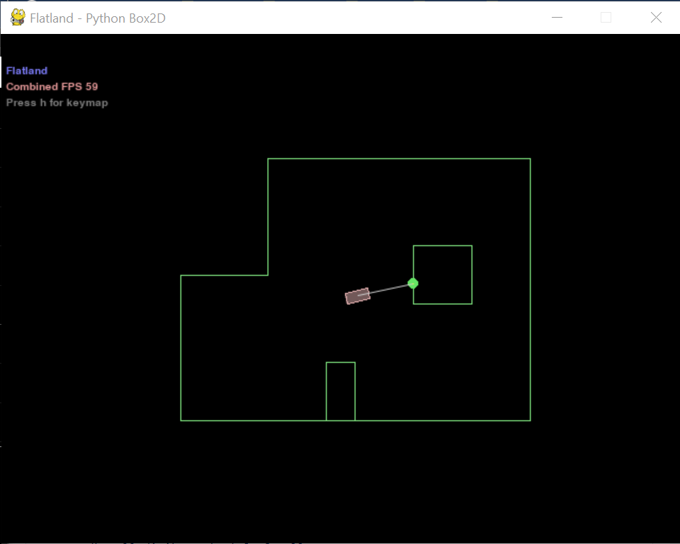
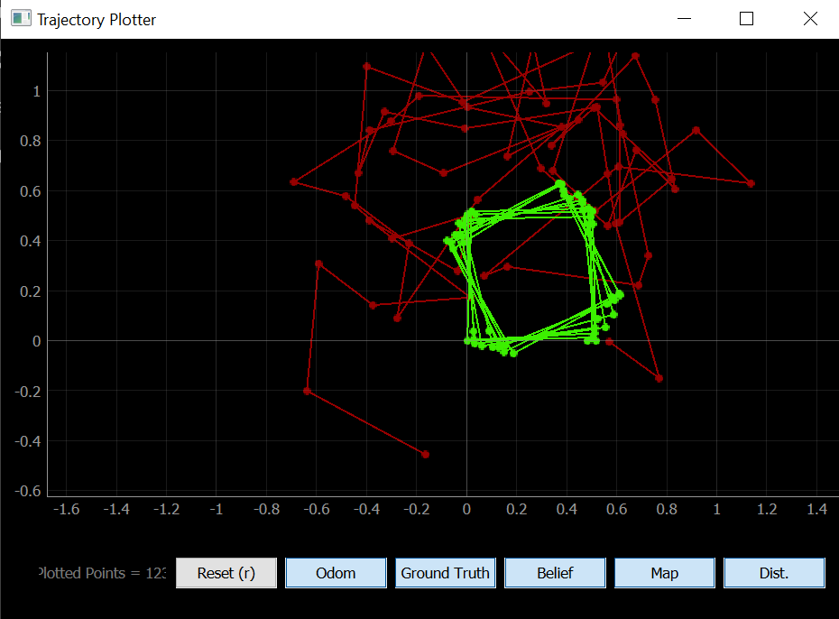

# Lab 10: Simulator

## Objective
For this lab, we used a simluation environment to control a virtual robot and help it navigate its virtual world. We also learned how to use the live plotting tool to find its location on the virtual map.

## 1. Simulator
The simulator has a rectangular robot that can move forward/backward and turn left/right. On the front, there is a laser range finder to detect the distance to obstacles in front of the robot.



In the trajectory plotter, the odometry and ground truth readings are plotted in red and green, respectively. Odometry relies of the data from onboard sensors (simulated IMU data in this case) to estimate change in position over time. Relative changes in the data can be used to make an estimate on the current robot position, however, this method is prone to errors due to measurement errors that build up over time. The ground truth is the most accurate measurement available, and in the case of the simulator, it is simply data on the exact position of the virtual robot.



In the provided simulator code, we can either manually move the robot using arrow keys or program it to move in a certain way by setting the linear velocity (m/s) and angular velocity (rad/s). The robot can get sensor readings, get the odometry and ground truth poses, and plot the data in the trajectory plotter.

## 2. Open Loop Control
Next, we want to make the robot go in a square around the map while plotting the ground truth and odometry of the robot. I used the following code to make it go in a full square:

```python
def plot_pose():
    pose, gt_pose = cmdr.get_pose()
    cmdr.plot_odom(pose[0], pose[1])
    cmdr.plot_gt(gt_pose[0], gt_pose[1])

cmdr.reset_plotter()
cmdr.reset_sim()

if cmdr.sim_is_running() and cmdr.plotter_is_running():
    for n in range(5):
        cmdr.set_vel(1, 0)
        await asyncio.sleep(0.5)
        cmdr.set_vel(0, 0)
        plot_pose()

        cmdr.set_vel(0, math.radians(90))
        await asyncio.sleep(1)
        cmdr.set_vel(0, 0)
        plot_pose()
```

In this code, the robot first goes forward at a speed of 1 m/s for half a second, then turns at an angular velocity of 90 rad/s for one second. For each action, the robot also gets the odometry and ground truth poses.

<iframe width="560" height="315" src="https://www.youtube.com/embed/aBzSmXOUngM" title="YouTube video player" frameborder="0" allow="accelerometer; autoplay; clipboard-write; encrypted-media; gyroscope; picture-in-picture" allowfullscreen></iframe>

The robot doesn't always execute a nice square, however.

<iframe width="560" height="315" src="https://www.youtube.com/embed/Nk46Qq1OLp0" title="YouTube video player" frameborder="0" allow="accelerometer; autoplay; clipboard-write; encrypted-media; gyroscope; picture-in-picture" allowfullscreen></iframe>

Over time, because the turns are not 100% accurate, the robot's squares start to drift off-center.

<iframe width="560" height="315" src="https://www.youtube.com/embed/M2Sl2KfQVVI" title="YouTube video player" frameborder="0" allow="accelerometer; autoplay; clipboard-write; encrypted-media; gyroscope; picture-in-picture" allowfullscreen></iframe>

## 3. Closed Loop Control
Lastly, we want to design a simple program that would allow the robot to perform obstacle avoidance. My idea was to have the robot continuously collect sensor readings, have it drive forward whenever it detects no obstacle in front of it, and then stop/turn when there is an obstacle. To test this, I first coded the robot to go forward and backward, stopping right in front of a wall.

```python
cmdr.reset_plotter()
cmdr.reset_sim()

time.sleep(1)

while cmdr.sim_is_running() and cmdr.plotter_is_running():
    sensor_values = cmdr.get_sensor()

    if sensor_values >= 0.2:
        cmdr.set_vel(1, 0)
        #await asyncio.sleep(0.01)
        plot_pose()
    elif sensor_values < 0.2:
        cmdr.set_vel(0, 0)
        await asyncio.sleep(0.5)
        cmdr.set_vel(-1, 0)
        await asyncio.sleep(1)
        plot_pose()
```

<iframe width="560" height="315" src="https://www.youtube.com/embed/P0DwgcGzTQY" title="YouTube video player" frameborder="0" allow="accelerometer; autoplay; clipboard-write; encrypted-media; gyroscope; picture-in-picture" allowfullscreen></iframe>

Once I got this working, I had the robot turn instead of go backwards when it hits an obstacle. I originally set the robot to turn 90 degrees each time it runs into a wall, but I decided that was boring and instead made it turn a random distance. To do this, I generated a random number between 0.1 and 1 and had the robot spin for that amount of time in seconds. In order to avoid hitting obstacles, I had the robot go at 1 m/s and initiate a turn whenever the sensor reading goes below a threshold of 0.25 m.

```python
import random
cmdr.reset_plotter()
cmdr.reset_sim()
time.sleep(1)

while cmdr.sim_is_running() and cmdr.plotter_is_running():
    sensor_values = cmdr.get_sensor()
    
    if sensor_values >= 0.25:
        cmdr.set_vel(1, 0)
        plot_pose()
    elif sensor_values < 0.25:
        cmdr.set_vel(0, 2*math.radians(90))
        await asyncio.sleep(random.uniform(0.1, 1))
        cmdr.set_vel(0, 0)
        plot_pose()
```

<iframe width="560" height="315" src="https://www.youtube.com/embed/FokXszr9kj0" title="YouTube video player" frameborder="0" allow="accelerometer; autoplay; clipboard-write; encrypted-media; gyroscope; picture-in-picture" allowfullscreen></iframe>

Next, I doubled the linear velocity of the robot to see if it could handle going faster. I found that the rate of collisions increased at a higher speed, so I then changed the threshold at which the robot initiates a turn to 0.3 m, and this helped lower the amount of collisions that occurred.

<iframe width="560" height="315" src="https://www.youtube.com/embed/Exnim4-txyU" title="YouTube video player" frameborder="0" allow="accelerometer; autoplay; clipboard-write; encrypted-media; gyroscope; picture-in-picture" allowfullscreen></iframe>

The distance at which the robot stops in front of a wall varied a lot, and in the runs that I did, the robot would always stop in between 0 m and the threshold that I set (either 0.25 or 0.3 m). The robot can get extremely close to an obstacle without colliding (within 0.05 m), though sometimes it can't stop in time and softly bumps into the wall. There are some other glitches that prevent the obstacle avoidance code from working all of the time. For example, if the robot is in a corner or very close to the wall, it will need to bump into the wall in order to turn since it is a bit bulky. In addition, there are other instances where the robot thinks the way ahead is clear, but then it accidentally clips its side on a corner and then goes slightly off course. One way to prevent collision issues is to increase the distance threshold so that the robot stays further from the wall. It would be very difficult to avoid the issue of clipping corners, but one possible way to address this issue is to put more distance sensors on the robot, especially on its edges/corners.

Before wrapping up, I decided to have some fun with the simulator. As a biological engineer, I wanted to see if I could make the robot implement some pseudo-bacterial chemotaxis behaviors. In bacterial chemotaxis, a bacterium does a sort of random walk in order to go towards/away from certain stimulants in its environment. The random walk consists of long "runs" where the bacterium takes a nice long walk in a semi-straight path, as well as short "tumbles" where the bacterium flails its flagella in order to change direction in a random, chaotic manner. In the simulation code, I set the angular velocity to an obscenely high value in order to simulate a "tumble," and I kept the randomly generated time for the duration of the spin. The result is as follows:

<iframe width="560" height="315" src="https://www.youtube.com/embed/ffwVOsev9rA" title="YouTube video player" frameborder="0" allow="accelerometer; autoplay; clipboard-write; encrypted-media; gyroscope; picture-in-picture" allowfullscreen></iframe>

While this was definitely not efficient, it sure was funny.

### [Click here to return to homepage](https://lyl24.github.io/lyl24-ece4960)
