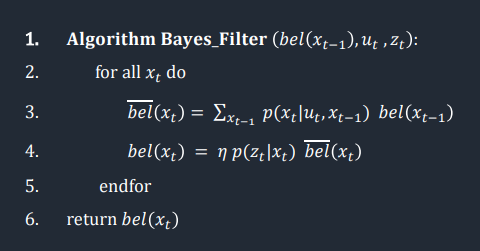
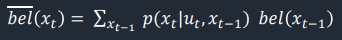
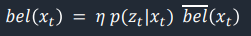

# Lab 11: Grid Localization using Bayes Filter

## Objective: The goal is to implement grid localization using Bayes Filter! Robot localization allows the robot to determine where it is located with respect to its environment, and in the previous lab, we found that using non-probabilistic methods lead to terrible results.

In this lab, we are using the same simulator program from Lab 10. The result from the Bayes filter will be displayed on the trajectory plotter alongside the odometry readings and ground truth. When implemented well, the Bayes filter trajectory should follow the ground truth trajectory closely. 

As opposed to the non-probabilistic methods from Lab 10, a Bayes filter is a probabilistic approach for estimating the location of the robot, and it does so recursively over time using a mathematical/statistical model paired with incoming measurements of the robot's environment. The general method for a Bayes filter is as follows:



## Code
Before running the code below, I first imported the ```numpy``` and ```math``` modules.

The Bayes filter code consists of five functions: ```compute_control```, ```odom_motion_model```, ```prediction_step```, ```sensor_model```, and ```update_step```.

### compute_control
This function extracts the control information for the robot based on the odometry motion model. It takes the current and previous odometry poses as inputs and returns information for the first rotation, translation, and second rotation needed to get the robot from the previous to the current pose.

```python
def compute_control(cur_pose, prev_pose):
    """
    Args:
        cur_pose  ([Pose]): Current Pose
        prev_pose ([Pose]): Previous Pose 

    Returns:
        [delta_rot_1]: Rotation 1  (degrees)
        [delta_trans]: Translation (meters)
        [delta_rot_2]: Rotation 2  (degrees)
    """
    
    cur_x, cur_y, cur_theta = cur_pose
    prev_x, prev_y, prev_theta = prev_pose
    
    degrees = np.degrees(np.arctan2(cur_y - prev_y, cur_x - prev_x))
    delta_rot_1 = loc.mapper.normalize_angle(degrees - prev_theta)
    delta_trans = np.sqrt((cur_pose[0]-prev_pose[0])**2+(cur_pose[1]-prev_pose[1])**2)
    delta_rot_2 = loc.mapper.normalize_angle(cur_theta - prev_theta - delta_rot_1)
    
    return delta_rot_1, delta_trans, delta_rot_2
```

The ```arctan2``` function in the numpy library outputs a value in radians in the -pi to pi range, and this can be converted to degrees using the ```degrees``` function. When subtracting angles, I used the ```normalize_angle``` function to convert all angles to a range between -180 and 180 degrees. 

### odom_motion_model
The odometry motion model function takes the current pose, previous pose, and control input as its arguments, and it returns the probability that the robot moves to a certain pose given the current pose and control input.

```python
def odom_motion_model(cur_pose, prev_pose, u):
    """
    Args:
        cur_pose  ([Pose]): Current Pose
        prev_pose ([Pose]): Previous Pose
        (rot1, trans, rot2) (float, float, float): A tuple with control data in the format 
                                                   format (rot1, trans, rot2) with units (degrees, meters, degrees)

    Returns:
        prob [float]: Probability p(x'|x, u)
    """
    
    rot1, trans, rot2 = compute_control(cur_pose, prev_pose) #actual movement
    rot1_u, trans_u, rot2_u = u #inputted movement

    rot1_prob = loc.gaussian(rot1, rot1_u, loc.odom_rot_sigma)
    trans_prob = loc.gaussian(trans, trans_u, loc.odom_trans_sigma)
    rot2_prob = loc.gaussian(rot2, rot2_u, loc.odom_rot_sigma)
    prob = rot1_prob*trans_prob*rot2_prob

    return prob
```

The Gaussian distribution is used to model the measurement noise, and it is like a simplified version of the Beam model. In the code above, the ```gaussian``` function helps determine how “probable” the transition of the robot state from the previous pose to the current pose is given the actual control input ("true" mean) and the rotation/translation noise (standard deviation).

### prediction_step
For the prediction step of the Bayes filter, the probabilities stored in bel_bar are updated based on the belief from the previous time step and the odometry motion model.

```python
def prediction_step(cur_odom, prev_odom):
    """ 
    Args:
        cur_odom  ([Pose]): Current Pose
        prev_odom ([Pose]): Previous Pose
    """
    
    u = compute_control(cur_odom, prev_odom)
    for x_prev in range(MAX_CELLS_X):
        for y_prev in range(MAX_CELLS_Y):
            for theta_prev in range(MAX_CELLS_A):
                if loc.bel[(x_prev, y_prev, theta_prev)] < 0.0001:
                    continue
                for x_cur in range(MAX_CELLS_X):
                    for y_cur in range(MAX_CELLS_Y):
                        for theta_cur in range(MAX_CELLS_A):
                            loc.bel_bar[(x_cur, y_cur, theta_cur)] += odom_motion_model(loc.mapper.from_map(x_cur, y_cur, theta_cur), loc.mapper.from_map(x_prev, y_prev, theta_prev), u)*loc.bel[(x_prev, y_prev, theta_prev)]
  
    loc.bel_bar = loc.bel_bar/np.sum(loc.bel_bar)
```

In order to run through every cell, I defined the following variables:

```python
MAX_CELLS_X = loc.mapper.MAX_CELLS_X
MAX_CELLS_Y = loc.mapper.MAX_CELLS_Y
MAX_CELLS_A = loc.mapper.MAX_CELLS_A
```

For all the previous values, if the belief is less than 0.0001, we can assume that the probability is basically zero and therefore ignore it. If the belief is greater than this value, the code then loops through all current values, and it updates bel_bar using the following equation:



Finally, since we assumed that all values lower than 0.0001 are simply 0, the probabilities across the grid might not perfectly add up to 1 anymore. In the last line of the prediction step, I included a step that normalizes the probabilities and fixes this issue.

### sensor_model
In the sensor model, the observations made in the rotation loop and the current pose are inputs, and the output is an array that stores the likelihood of each individual measurement (equivalent to p(z|x) ).

```python
def sensor_model(obs, cur_pose):
    """ 
    Args:
        obs ([ndarray]): A 1D array consisting of the measurements made in rotation loop

    Returns:
        [ndarray]: Returns a 1D array of size 18 (=loc.OBS_PER_CELL) with the likelihood of each individual measurements
    """
    
    prob_array = []
    for i in range(18):
        prob_value = loc.gaussian(obs[i], cur_pose[i], loc.sensor_sigma)
        prob_array.append(prob_value)
    return prob_array
```

This function uses the Gaussian function to determine the probability that we get a certain distance observation given the current position of the robot and sensor noise.

### update_step
In the final step, the probabilities stored in bel are updated based on bel_bar and the sensor model.

```python
def update_step():
    for x in range(0, MAX_CELLS_X):
        for y in range(0, MAX_CELLS_Y):
            for theta in range(0, MAX_CELLS_A):
                loc.bel[(x, y, theta)] = np.prod(sensor_model(loc.obs_range_data,mapper.get_views(x, y, theta)))*loc.bel_bar[(x, y, theta)] 

    loc.bel = loc.bel/np.sum(loc.bel) 
```

First, I ran through every cell, and for each cell, the belief is updated according to the following equation:



Next, I normalized the probabilities similar to what I did in the prediction step.

## Run the Bayes Filter
It's time to run the code and see how the Bayes filter holds up. I recorded videos of the trajectory plotter with the ground truth (green line), odometry readings (red line), and Bayes filter values (blue line). In the second video, the squares on the map represent the probability that the robot is in a certain grid location, with white being the most probable location.

<iframe width="560" height="315" src="https://www.youtube.com/embed/beD7GwoiV-Y" title="YouTube video player" frameborder="0" allow="accelerometer; autoplay; clipboard-write; encrypted-media; gyroscope; picture-in-picture" allowfullscreen></iframe>

<iframe width="560" height="315" src="https://www.youtube.com/embed/xo_qTzhsBpI" title="YouTube video player" frameborder="0" allow="accelerometer; autoplay; clipboard-write; encrypted-media; gyroscope; picture-in-picture" allowfullscreen></iframe>

(Discussion)

### [Click here to return to homepage](https://lyl24.github.io/lyl24-ece4960)
