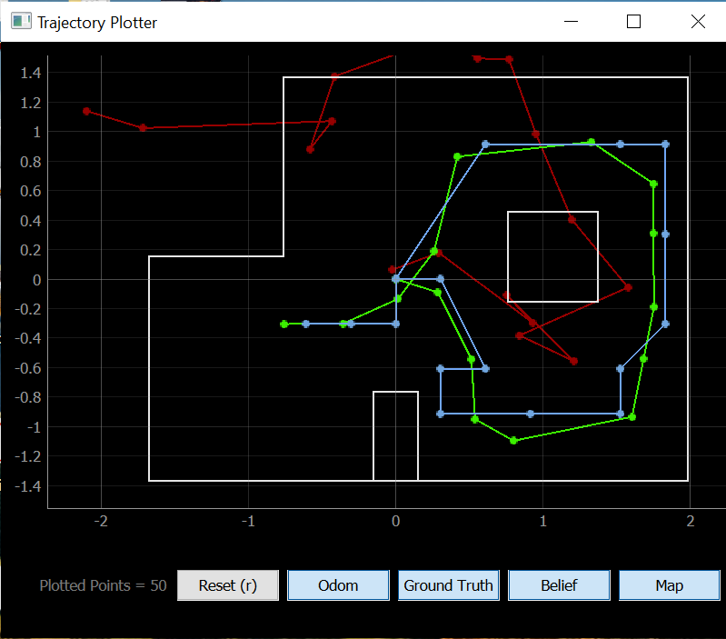

# Lab 12: Localization (real)

## Objective
For this lab, the goal is to use only the update step of the Bayes filter to perform localization on the real robot. In the lab, there are four poses marked on the ground, and for each pose, we want to run an observation loop to find the distance in front of the robot at each angle. 

The implementation of this lab should be extremely similar to Lab 9, and the main difference is that the data sent back by the robot needs to be in a format that can be run through the Bayes filter code in Python. The overall gist is that the robot turns 20 degrees, takes a distance reading, then keeps looping this process until 18 readings between 0-360 degrees are obtained. Then, the robot sends the angle and TOF distanec readings to my computer using Bluetooth. This sounds easy at first, but I had a feeling this lab would be a struggle considering the fact that my robot's wheels barely work at this point, leading to a lot of inaccuracies in Lab 9.

## Part 1: Test Localization in Simulation
After running the notebook with the Bayes filter solution, I obtained the following plot.

As seen in the plot, the ground truth is in green, the odometry readings are in red, and the Bayes filter result is in blue. 

[Motor Driver Datasheet](https://www.ti.com/lit/ds/symlink/drv8833.pdf?HQS=dis-dk-null-digikeymode-dsf-pf-null-wwe&ts=1646507944819&ref_url=https%253A%252F%252Fcei-lab.github.io%252F)

### [Click here to return to homepage](https://lyl24.github.io/lyl24-ece4960)
