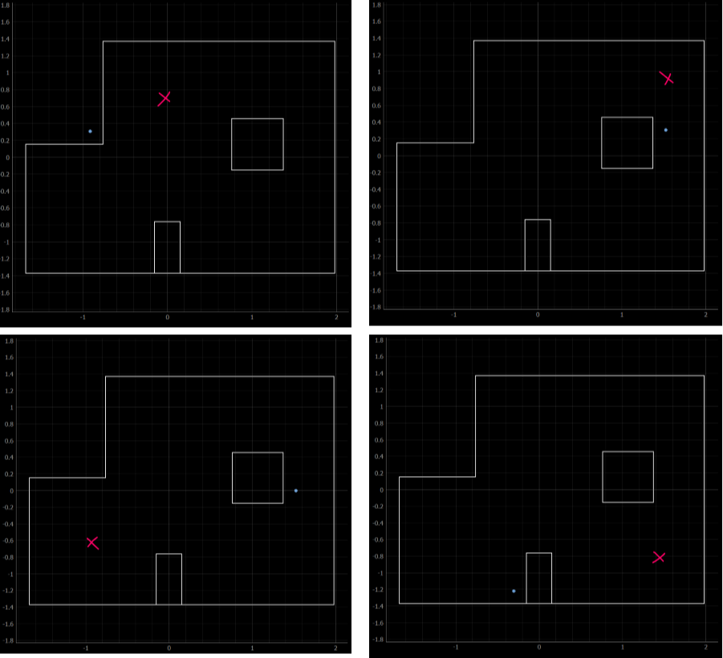
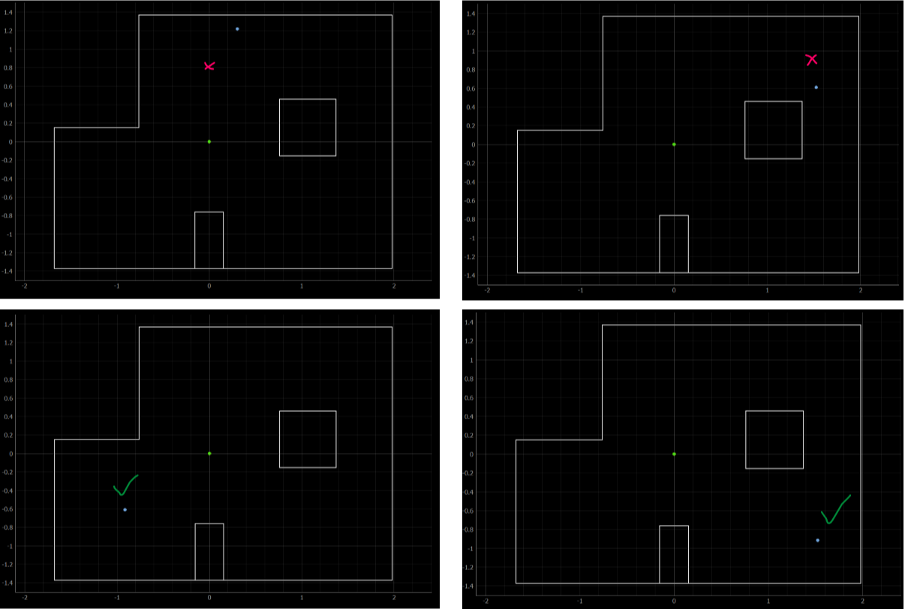

# Lab 12: Localization (real)

## Objective
For this lab, the goal is to use only the update step of the Bayes filter to perform localization on the real robot. In the lab, there are four poses marked on the ground, and for each pose, we want to run an observation loop to find the distance in front of the robot at each angle. 

The implementation of this lab should be extremely similar to Lab 9, and the main difference is that the data sent back by the robot needs to be in a format that can be run through the Bayes filter code in Python. The overall gist is that the robot turns 20 degrees, takes a distance reading, then keeps looping this process until 18 readings between 0-360 degrees are obtained. Then, the robot sends the angle and TOF distanec readings to my computer using Bluetooth. This sounds easy at first, but I had a feeling this lab would be a struggle considering the fact that my robot's wheels barely work at this point, leading to a lot of inaccuracies in Lab 9.

## Test localization in simulation
After running the notebook with the Bayes filter solution, I obtained the following plot.


As seen in the plot, the ground truth is in green, the odometry readings are in red, and the Bayes filter result is in blue. 

## Implement observation loop functions
As previously mentioned, we want the robot to be able to rotate in a circle and gather 18 distance readings and the corresponding angle/heading. In order to do this, I reused code from Lab 9 and implemented the turning and data-sending functions as commands in Arduino.

```cpp
current_gyrX = 0.0;
tof_distance = get_tof_2();
gyr_array[0] = current_gyrX;
tof_array[0] = tof_distance;

setpoint = 20;
counter = 1;
motorspeed = 100;

while(counter < 18){
    previous_time = current_time;
    myICM.getAGMT();
    current_time = millis();
    previous_gyrX = current_gyrX;
    current_gyrX = get_gyroscope(&myICM);

    error_value = setpoint - current_gyrX;

    if(error_value > 1.0 && setpoint < 350.0){
      turn_left();     
    }
    else if(error_value <= 1.0 && setpoint < 350.0){
      brake();
      delay(300);
      tof_distance = get_tof_2();
      gyr_array[counter] = current_gyrX;
      tof_array[counter] = tof_distance;
      counter++;
      setpoint = setpoint + 20;
      current_time = millis();
    }
    else{
      brake();
    }
}

for (int i=0; i<18; i++){
  imu_float.writeValue(gyr_array[i]);
  tof_2_float.writeValue(tof_array[i]);
}
break;
```

In the above code, the robot is supposed to get the initial angle and distance reading, then turn 20 degrees counter-clockwise and repeat this process. At each point in this loop, the data is stored in float arrays, and once all the data is collected, it is sent to my computer using Bluetooth.

In the Jupyter notebook, I edited the ```perform_observation_loop``` of class ```RealRobot``` in order to handle the data sent from the robot.

```python
def perform_observation_loop(self, rot_vel=120):
        self.setup_notify()
        self.ble.send_command(CMD.OBSERVATION, None)
        #await asyncio.sleep(30)
        time.sleep(30)

        tof_readings = [x / 1000 for x in self.tof_2_readings]
        imu_readings = [x / 1000 for x in self.imu_readings]
        
        sensor_ranges = np.array(tof_readings[0:18])[np.newaxis].T
        sensor_bearings = np.array(imu_readings[0:18])[np.newaxis].T

        return sensor_ranges, sensor_bearings
```

While the above code was able to get the robot to perform the observation loop, the arrays that were returned were sometimes empty. After discussing with the TAs, we thought that the ```time.sleep()``` function may have messed things up, but after implementing ```await asyncio.sleep()``` I found that the arrays returned were now always empty. In addition, the robot still overshoots each 20 degree turn by about 5 degrees (even when PID control is implemented), adding to all the existing problems. Since the results I was getting were so inconsistent, I realized that I probably had to revamp most of my code. Before embarking on a new path, I managed to squeeze out the following results using the code above.



In the above plots, the blue dots are the results from my localization code, and the red x's are approximately where the robot is actually located. The predicted locations are quite far off from the ground truth.

## Implement observation loop functions: part 2
After my first approach didn't work, I edited the robot code so that the robot used P control on the angle while executing the observation loop. In addition, instead of storing all of the IMU and TOF sensor data in arrays and sending it after running the observation loop, I modified the code so that the robot would send the data after each individual turn. 

'''cpp
while(counter < 18){
    previous_time = current_time;
    myICM.getAGMT();
    current_time = millis();
    previous_gyrZ = current_gyrZ;
    current_gyrZ = get_gyroscope(&myICM);

    error_value = setpoint - current_gyrZ;
    float proportional_term = error_value*kp;

    if(error_value > 1.0 && setpoint < first_gyrZ + 350.0){
      motorspeed = map(proportional_term, 0, 30, 100, 150);
      turn_left();     
    }
    else if(error_value <= 1.0 && setpoint < first_gyrZ + 350.0){
      brake();
      delay(100);
      tof_distance = get_tof_2();
      //gyr_array[counter] = current_gyrZ;
      //tof_array[counter] = tof_distance;
      //counter++;
      tof_2_float.writeValue(tof_distance);
      imu_float.writeValue(current_gyrZ);
      setpoint = setpoint + 20;
      current_time = millis();
    }
    else{
      brake();
    }
    }
'''

In the Jupyter notebook, I modified the observation loop function so that instead of '''time.sleep()''', I used '''await asyncio.sleep()'''. Since the robot sends the individual data readings one by one, I also inserted a while loop so that the code waits for 18 readings before moving on and returning the proper arrays.

'''python
async def perform_observation_loop(self, rot_vel=120):
    self.setup_notify()
    self.ble.send_command(CMD.OBSERVATION, None)
    await asyncio.sleep(11)

    while len(self.tof_readings) < 18 or len(self.imu_readings) < 18:
        await asyncio.sleep(1)

    tof_readings = [x / 1000 for x in self.tof_readings]
    imu_readings = self.imu_readings

    tof_readings.reverse()
    imu_readings.reverse()

    sensor_ranges = np.array(tof_readings)[np.newaxis].T
    sensor_bearings = np.array(imu_readings)[np.newaxis].T

    return sensor_ranges, sensor_bearings
'''

Finally, I modified the code so that I could run the observation loop using Jonathan's robot. My robot had a set of wheels that would sometimes stop working, and the static friction was so high that it could barely make it through the observation loop. With all of these modifications, I was able to get the robot to turn very smoothly in a circle and obtained the following results. 



As seen in the image above, the red crosses indicate where the robot was actually located, the blue dots are the belief, and the green dot at the middle is (0,0). The green check marks indicate that the blue dots are at the correct position, and the results were much improved from the first attempt. The two points at the top of the map were slightly off but still in the correct area, while the two points at the bottom of the map were spot-on. Unfortunately, I forgot to get the robot's belief for the first three points I ran, but I did salvage the belief for the final point (top left).

'''
2022-05-19 15:56:35,463 | INFO     |: Update Step
2022-05-19 15:56:35,471 | INFO     |:      | Update Time: 0.008 secs
2022-05-19 15:56:35,471 | INFO     |: Bel index     : (6, 8, 12) with prob = 0.9958695
2022-05-19 15:56:35,480 | INFO     |: Bel_bar prob at index = 0.00051440329218107
2022-05-19 15:56:35,481 | INFO     |: Belief        : (0.305, 1.219, 70.000)
'''

### [Click here to return to homepage](https://lyl24.github.io/lyl24-ece4960)
