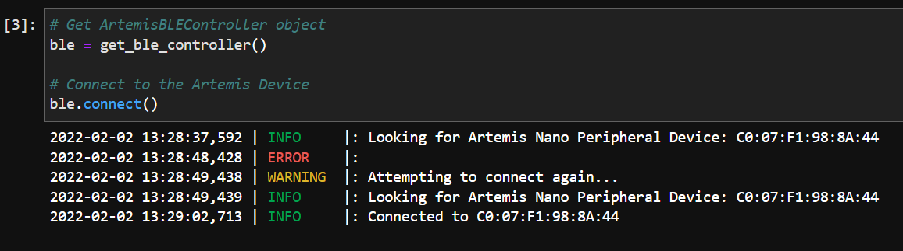
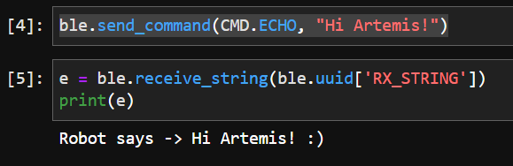
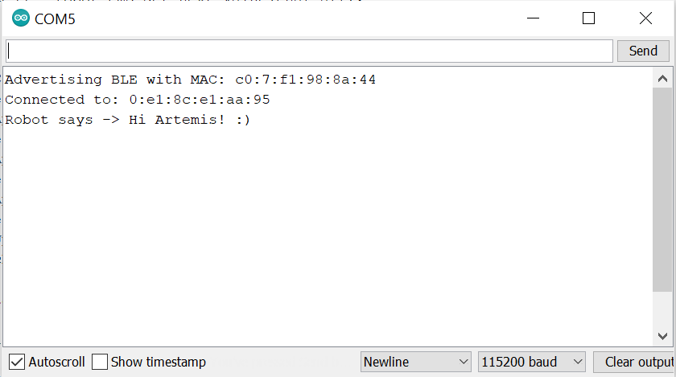
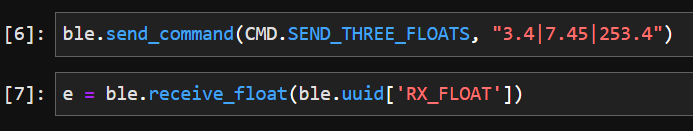
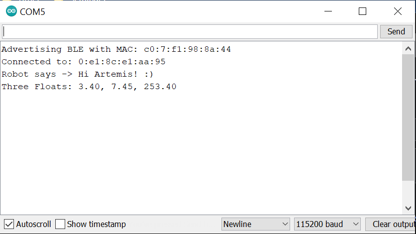

# Lab 2: Bluetooth

## Objective: Establish communication between my computer and the Artemis board through the bluetooth stack

## Setup:
To set up for this lab, I first updated Python 3 and pip so that I had the latest releases on my device (Python >= 3.9 and pip >= 21.0). I then created a virtual environment for ECE 4960 and installed the necessary Python and Artemis packages for this course. Fortunately, this all went smoothly, and I was able to open the Lab 2 codebase in Jupyter successfully. Next, I burned the sketch ```ble_arduino.ino``` into the Artemis board from the codebase, and the board output the following in the serial monitor:
```Advertising BLE with MAC: c0:7:f1:98:8a:44```.

I updated ```artemis_address``` in ```connection.yaml``` (Python codebase) to match this MAC address, allowing for a communication channel to be established between my computer and the Artemis board through BLE.  



## Task 1: ECHO
For this task, we want to send an ECHO command with a string value from the computer to the Artemis board, then receive an augmented string on the computer. To do this, I wrote the following code with explanations in the ```ble_arduino.ino``` sketch:

```
case ECHO:

    char char_arr[MAX_MSG_SIZE];

    // Extract the next value from the command string as a character array
    success = robot_cmd.get_next_value(char_arr);
    if (!success)
        return;
        //This step checks for a valid input

    // Clear the contents of the EString before using it
    tx_estring_value.clear();
    // Append the string literal "Robot says -> "
    tx_estring_value.append("Robot says -> ");
    // Append the value stored in char_arr, extracted from the command string above
    tx_estring_value.append(char_arr);
    // Append the string literal " :)"
    tx_estring_value.append(" :)");
    // Update the TX String characteristic with the appended string
    tx_characteristic_string.writeValue(tx_estring_value.c_str());

    Serial.println(tx_estring_value.c_str());

    break;
```

After burning the updated sketch to the board, I called the following commands in Jupyter notebook.  


Using the ECHO command, we receive the original string with the prefix "Robot says -> " and the postfix " :)". This output can also be viewed in the Arduino serial monitor.  


## Task 2: SEND_THREE_FLOATS
Now, we want to send three floats to the Artemis board using the ```SEND_THREE_FLOATS``` command, then extract the three float values in the Arduino sketch. I added the following code with explanations to the ```ble_arduino.ino``` sketch:

```
case SEND_THREE_FLOATS:
    float float_a, float_b, float_c;

    // Extract the next value from the command string as a float
    success = robot_cmd.get_next_value(float_a);
    if (!success)
        return;
    // Extract the next value from the command string as a float
    success = robot_cmd.get_next_value(float_b);
    if (!success)
        return;
    // Extract the next value from the command string as a float
    success = robot_cmd.get_next_value(float_c);
    if (!success)
        return;
    // The if statements check for a valid input

    Serial.print("Three Floats: ");
    Serial.print(float_a);
    Serial.print(", ");
    Serial.print(float_b);
    Serial.print(", ");
    Serial.println(float_c);
    break;
```

Next, I used the following code in the Jupyter notebook to send three floats to the board.


The results can be viewed in the Arduino serial monitor.


As seen above, the output consists of the three floats that we sent to the board. In addition, each float has the same number of decimal places to match the value with the highest number of digits after the decimal point (7.45).

## Task 3: Notification Handler
In this step, we want to set up a notification handler in Python to receive the float value from the Artemis board. This can be done with the ```start_notify``` and ```stop_notify``` functions.  

```
ble.stop_notify(ble.uuid['RX_FLOAT'])
```  

```
get_float = 0
def handle_notify(uuid, byte_array):
    extracted_float = ble.bytearray_to_float(byte_array)
    global get_float 
    get_float = extracted_float
    print(get_float)
    
ble.start_notify(ble.uuid['RX_FLOAT'], handle_notify)
```  

In the code above, the notification handler receives a float value from the board, and the float is extracted into ```extracted_float``` using the ```bytearray_to_float``` function. Next, this value is transferred to the global variable ```get_float``` and is printed so that we can see every time the characteristic value changes. The ```stop_notify``` function above is used to turn off the notifications.  

<iframe width="560" height="315" src="https://www.youtube.com/embed/AW7HkeR5Uy4" title="YouTube video player" frameborder="0" allow="accelerometer; autoplay; clipboard-write; encrypted-media; gyroscope; picture-in-picture" allowfullscreen></iframe>

In this video, we can see that as soon as the notification handler is run, all updates to the characteristic value are printed out. Then, after stopping the notification handler, we can print out ```get_float``` to see the last value stored in this global variable.

## Part 4: Serial

## Additional Task 1: 

## Additional Task 2: 

### [Click here to return to homepage](https://lyl24.github.io/lyl24-ece4960)
