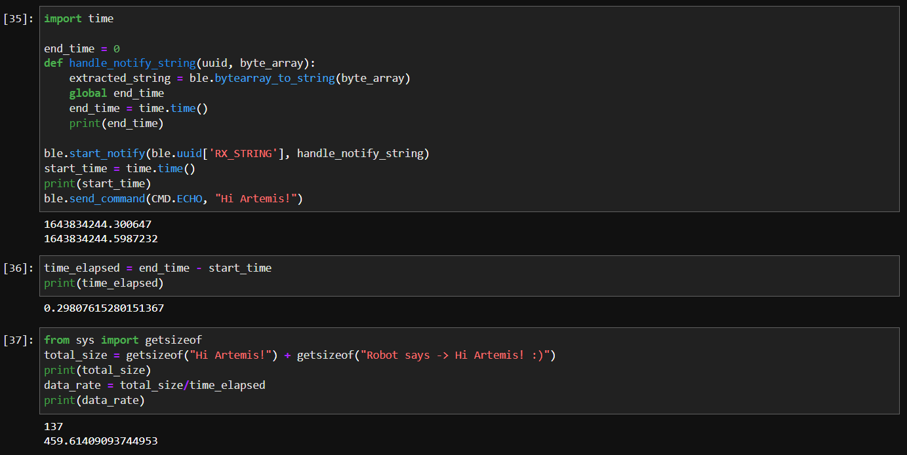
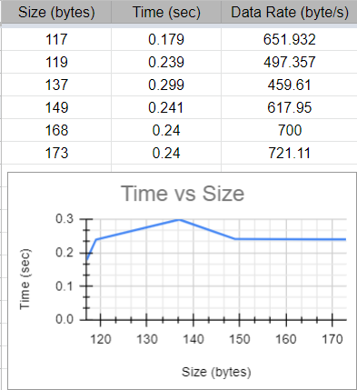
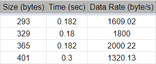

# Lab 2: Bluetooth

## Objective: Establish communication between my computer and the Artemis board through the bluetooth stack

## Setup:
To set up for this lab, I first updated Python 3 and pip so that I had the latest releases on my device (Python >= 3.9 and pip >= 21.0). I then created a virtual environment for ECE 4960 and installed the necessary Python and Artemis packages for this course. Fortunately, this all went smoothly, and I was able to open the Lab 2 codebase in Jupyter successfully. Next, I burned the sketch ```ble_arduino.ino``` into the Artemis board from the codebase, and the board output the following in the serial monitor:
```Advertising BLE with MAC: c0:7:f1:98:8a:44```.

I updated ```artemis_address``` in ```connection.yaml``` (Python codebase) to match this MAC address, allowing for a communication channel to be established between my computer and the Artemis board through BLE.  


## Task 1: ECHO
For this task, we want to send an ECHO command with a string value from the computer to the Artemis board, then receive an augmented string on the computer. To do this, I wrote the following code with explanations in the ```ble_arduino.ino``` sketch:

```
case ECHO:

    char char_arr[MAX_MSG_SIZE];

    // Extract the next value from the command string as a character array
    success = robot_cmd.get_next_value(char_arr);
    if (!success)
        return;
        //This step checks for a valid input

    // Clear the contents of the EString before using it
    tx_estring_value.clear();
    // Append the string literal "Robot says -> "
    tx_estring_value.append("Robot says -> ");
    // Append the value stored in char_arr, extracted from the command string above
    tx_estring_value.append(char_arr);
    // Append the string literal " :)"
    tx_estring_value.append(" :)");
    // Update the TX String characteristic with the appended string
    tx_characteristic_string.writeValue(tx_estring_value.c_str());

    Serial.println(tx_estring_value.c_str());

    break;
```

After burning the updated sketch to the board, I called the following commands in Jupyter notebook.  


Using the ECHO command, we receive the original string with the prefix "Robot says -> " and the postfix " :)". This output can also be viewed in the Arduino serial monitor.  


## Task 2: SEND_THREE_FLOATS
Now, we want to send three floats to the Artemis board using the ```SEND_THREE_FLOATS``` command, then extract the three float values in the Arduino sketch. I added the following code with explanations to the ```ble_arduino.ino``` sketch:

```
case SEND_THREE_FLOATS:
    float float_a, float_b, float_c;

    // Extract the next value from the command string as a float
    success = robot_cmd.get_next_value(float_a);
    if (!success)
        return;
    // Extract the next value from the command string as a float
    success = robot_cmd.get_next_value(float_b);
    if (!success)
        return;
    // Extract the next value from the command string as a float
    success = robot_cmd.get_next_value(float_c);
    if (!success)
        return;
    // The if statements check for a valid input

    Serial.print("Three Floats: ");
    Serial.print(float_a);
    Serial.print(", ");
    Serial.print(float_b);
    Serial.print(", ");
    Serial.println(float_c);
    break;
```

Next, I used the following code in the Jupyter notebook to send three floats to the board.


The results can be viewed in the Arduino serial monitor.


As seen above, the output consists of the three floats that we sent to the board. In addition, each float has the same number of decimal places to match the value with the highest number of digits after the decimal point (7.45).

## Task 3: Notification Handler
In this step, we want to set up a notification handler in Python to receive the float value from the Artemis board. This can be done with the ```start_notify``` and ```stop_notify``` functions.  

```
ble.stop_notify(ble.uuid['RX_FLOAT'])
```  

```
get_float = 0
def handle_notify(uuid, byte_array):
    extracted_float = ble.bytearray_to_float(byte_array)
    global get_float 
    get_float = extracted_float
    print(get_float)
    
ble.start_notify(ble.uuid['RX_FLOAT'], handle_notify)
```  

In the code above, the notification handler receives a float value from the board, and the float is extracted into ```extracted_float``` using the ```bytearray_to_float``` function. Next, this value is transferred to the global variable ```get_float``` and is printed so that we can see every time the characteristic value changes. The ```stop_notify``` function above is used to turn off the notifications.  

<iframe width="560" height="315" src="https://www.youtube.com/embed/AW7HkeR5Uy4" title="YouTube video player" frameborder="0" allow="accelerometer; autoplay; clipboard-write; encrypted-media; gyroscope; picture-in-picture" allowfullscreen></iframe>

In this video, we can see that as soon as the notification handler is run, all updates to the characteristic value are printed out. Then, after stopping the notification handler, we can print out ```get_float``` to see the last value stored in this global variable.

## Part 4: 

## Additional Task 1: Effective Data Rate
In this task, we want to first send a message from the computer and receive a reply from the Artemis board, then calculate the data rate. To do this, I wrote the following Python code.

```
import time

end_time = 0
def handle_notify_string(uuid, byte_array):
    extracted_string = ble.bytearray_to_string(byte_array)
    global end_time
    end_time = time.time()
    print(end_time)

ble.start_notify(ble.uuid['RX_STRING'], handle_notify_string)
start_time = time.time()
print(start_time)
ble.send_command(CMD.ECHO, "Hi Artemis!")
```

First, I imported the Python time library, which contains the ```time``` function and allows me to find the amount of time in seconds elapsed since January 1st, 1970. Before running the ECHO command, I got the current time and stored the value into ```start_time```. Next, I wrote a modified version of the notification handler from part 3 that can handle string inputs. Within this function, as soon as there is a change detected in the string characteristic value, this means that the board has created and sent a reply. We can get the time of this event using the ```time``` function again, and this is stored in the global variable ```end_time```. To find the time elapsed, we can take the difference between the start and end events. 

```
time_elapsed = end_time - start_time
print(time_elapsed)
```

To calculate data rate, we take the size of the outgoing message plus the size of the return message from the board (both in bytes), then divide by the time elapsed in seconds. For the example message above, we sent "Hi Artemis!" and receieved "Robot says -> Hi Artemis :)".  

```
from sys import getsizeof
total_size = getsizeof("Hi Artemis!") + getsizeof("Robot says -> Hi Artemis! :)")
print(total_size)
data_rate = total_size/time_elapsed
print(data_rate)
```

With this code, the total amount of data transferred was 137 bytes, and the time elapsed was 0.298 seconds. Dividing the size by time, we get a data rate of 459.61 bytes/second.  



We can test out different outgoing messages to modify the total amount of data transferred, then measure the time elapsed and data rate. I collected data for messages of varying sizes in the table below, and I created a plot of the amount of data transferred vs time elapsed.  



As seen in the image, the plot does not really show a clear pattern. Each time I ran the code to compute data rate, the values for time elapsed would change somewhat drastically, and the resulting values for data rate were also affected. From this data, I concluded that for an amount of data between 100-200 bytes, the data rate is about 500-700 bytes per second.

## Additional Task 2: 
Next, we want to figure out what happens when you send data at a higher rate from the robot to the computer, and if the computer reads all the data published without missing anything from the Artemis board. To test this out, I sent an extremely long string consisting of many repeating hello's as the outgoing message, however, this ended up with the following error: ```Exception: Cannot write string larger than 150 bytes```. I decreased the number of hello's in my string and gathered the following data.



The data rate clearly increased as compared to Additional Task 1. The messages sent from the board back to the computer were also perfectly accurate, and it did not seem like the computer missed any of the data from the Artemis board. (The return messages consisted of ```Robots says -> Hello hello hello ... :)``` with varying amounts of hello's, and each one of these messages contained the correct number of hello's. Unfortunately, I cannot include a screenshot here since these messages were obscenely long due to the large number of hello's.)

Thanks for reading!

### [Click here to return to homepage](https://lyl24.github.io/lyl24-ece4960)
