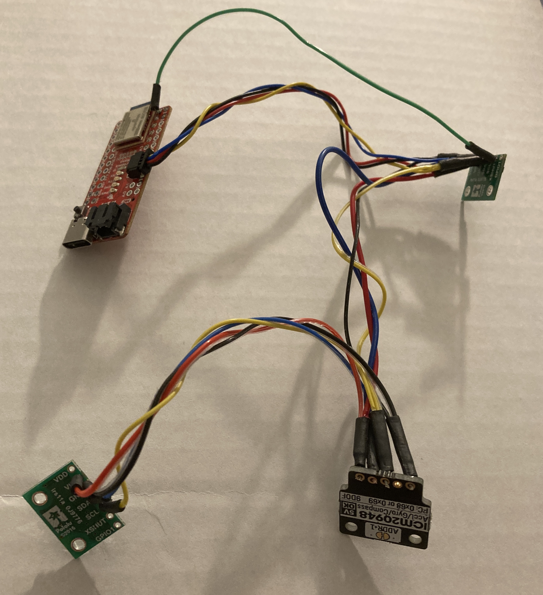

# Lab 3: Sensors

## Objective: Equip the robot with sensors - the Time-of-Flight Sensors (ToF) and the Inertial Measurement Unit (IMU).

## Prelab:
Before starting this lab, I needed to figure out a plan for the wiring on the robot. I read the datasheets for the Artemis Nano, VL53L1X Time-of-Flight (ToF) sensors, ICM-20948 IMU sensor, and the dual motor driver carrieres. I drew out the pins on each sensor and drew a rough diagram of how each sensor could be connected to the Artemis board, as well as where each sensor would be placed on the robots.

Originally, I thought about putting both ToF sensors on the front of the robot, each at a slight outward angle. Since each ToF sensor has a field of view (FoV) of approximately 27 degrees, placing them at an angle would theoretically help expand the total FoV. However, I later learned in lab that this setup would not only be redundant, it could also cause interference between the two sensors. Therefore, I decided to have one sensor on the front and one on the side of the robot. The gyroscope will be placed on a flat surface near the center of the robot, though I also have to be careful about not putting it too close to the motors as this would lead to elecromagnetic interference.

In addition, the I2C addresses for the ToF sensors are the same (0x52). The address is hardwired onto the board I would not be able to address the two sensors individually as is. To solve this, I chose to connect the shutdown pin on one of the ToF sensors to the Artemis board, and this will allow me to change the address programmatically upon startup. (First, use the shutdown pin to shut down one of the sensors, then change the address on the active sensor.) I chose this option over enabling the two sensors separately through their respective shutdown pins because I thought it would be easier for me to address this problem through code.

## Lab 3(a): Time of Flight Sensors
First, I installed the SparkFun VL53L1X 4m laser distance sensor library in Arduino, and I connect one of the VL53L1X breakout boards to the Artemis board using the QWIIC-to-cable connector. I used daisy chaining to connect the other ToF sensor and IMU as well, and these components were sautered together. I ran out of time during my lab session, so I finished soldering in the Maker Lab in Philips Hall.

As seen below, the boards are hooked up in the following order: Artemis Nano -> ToF sensor #1 -> IMU -> ToF sensor #2. The XSHUT pin on ToF sensor #1 is connected to pin 8 on the Artemis board.

### Task 1: Scan the I2C channel to find the sensor
To do this, I went to File->Examples->Wire and opened Example1_wire. I ran the code, and 
Does the address match what you expected? If not, explain why.

### Task 2: ToF Sensor Modes
The ToF sensor has three modes that optimize the ranging performance given the maximum expected range ('''.setDistanceModeShort()'''; '''.setDistanceModeMedium()''';  '''.setDistanceModeLong()'''). The short distance mode (1.3 m) would be best for quickly scanning the space immediately in front of the robot, since it would not have to wait as long as the medium and long modes for a return signal. However, it would not be able to see objects further ahead, possibly preventing the robot from being able to easily avoid obstacles. The long distance mode (4 m) would theoretically be the opposite -- it will be able to see objects further ahead and easily change its route to avoid these obstacles, however, it would take more time to measure longer distances. The medium distance mode (3 m) is a compromise between the short and long distance modes, and this could be the best option for the robot. Given the speed at which the robot is intended to go, this mode would allow the robot to sufficiently see obstacles up ahead and allow for quick sensing.

### Task 3: Test ToF Sensor Mode
Using the “..\Arduino\libraries\SparkFun_VL53L1X_4m_Laser_Distance_Sensor\examples\Example1_ReadDistance” example and a ruler, I tested out the medium distance mode and documented the ToF sensor range, accuracy, repeatability, and ranging time. 

Check and discuss whether the sensor is sensitive to different colors and textures.

### Task 4: Two ToF Sensors
Using notes from the pre-lab, hook up both ToF sensors simultaneously and demonstrate that both works.

### Additional Task 1: Infrared Sensors
Many distance sensors are based on infrared trasmission, and there are two types of infrared sensors: active IR sensors emit and receive infrared radiation to detect motion and proximity, while passive IR sensors receive natural infrared radiation from nearby objects and are activated when there is a change in the IR waves in the environment. Active IR sensors are good for robotics, while passive IR sensors are good for detecting the movement of people, animals, and objects.

Passive IR sensors are inexpensive, and they are sensitive to changes in the IR radiation in its detection field. However, they are not good for robotics compared to active IR sensors since passive sensors rely on a change in the basal IR radiation in the environment, and many scenarios that involve robots can include static objects that do not move. Active IR sensors are reliable for object detection, however, IR radiation such as that emitted by a diode in an active IR sensor can damage eyes. Environmental conditions such as fog, rain, smoke, etc would also affect this type of sensor more. (Finding the distance of an object in the fog is difficult, but figuring out if something is moving in the fog is easier.)

Some other broad uses of IR sensors include night vision, tracking nanoparticles in living organisms, home security, missile tracking in military activities, and telescopes/solid-state detectors in astronomy.

Source: [https://www.getkisi.com/guides/infrared-sensors](https://www.getkisi.com/guides/infrared-sensors)

## Lab 3(b): IMU

## Setup the IMU
First, I installed the SparkFun 9DOF IMU Breakout - ICM 20948 - Arduino Library. After scanning the I2C channel in the same way as the ToF sensor, I found that _____.

## Accelerometer

## Gyroscope

## Additional Task: Magnetometer

### [Click here to return to homepage](https://lyl24.github.io/lyl24-ece4960)
