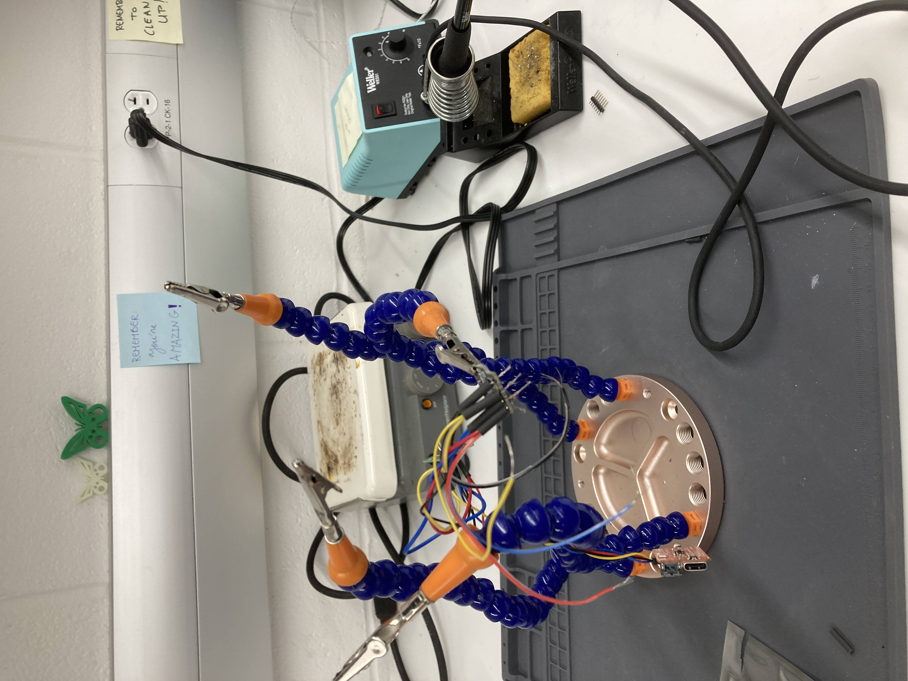
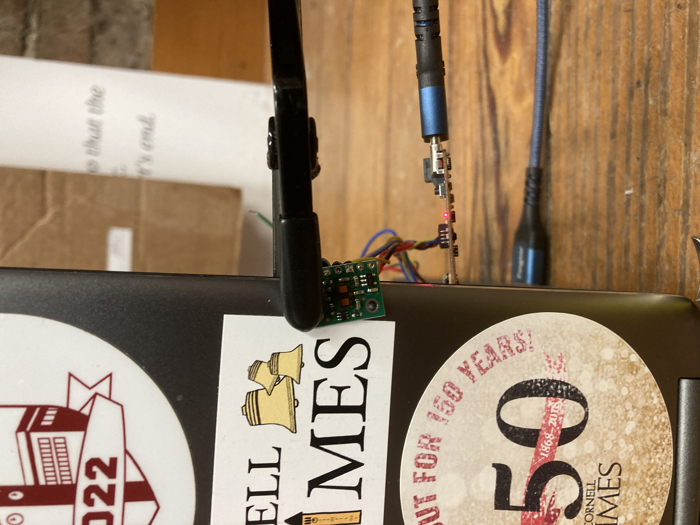
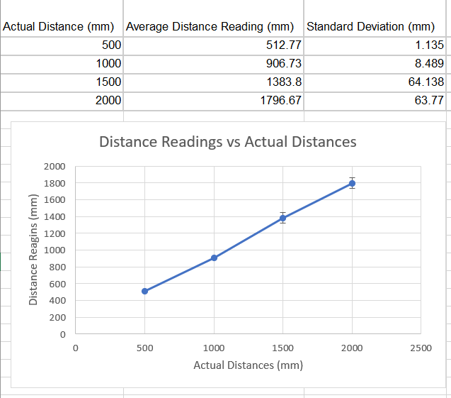
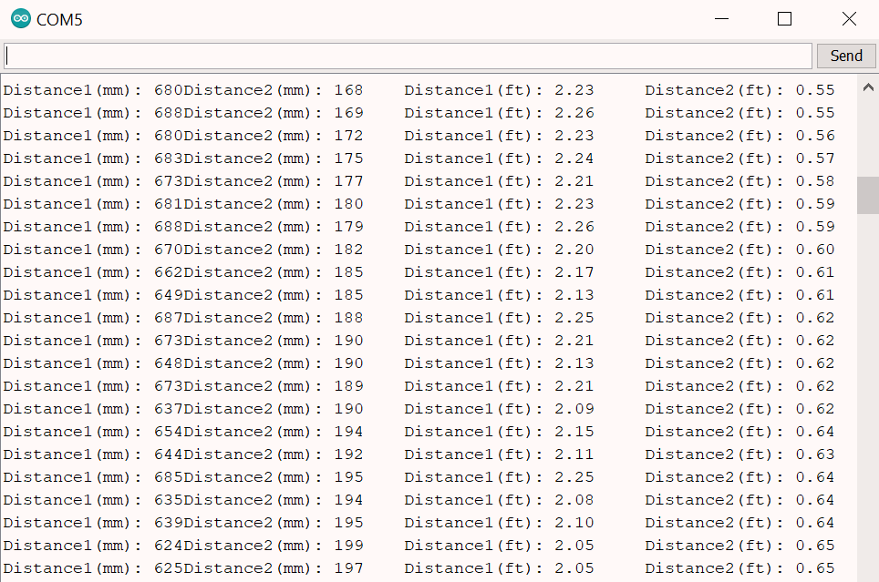

# Lab 3: Sensors

## Objective: Equip the robot with sensors - the Time-of-Flight Sensors (ToF) and the Inertial Measurement Unit (IMU).

## Prelab:
Before starting this lab, I needed to figure out a plan for the wiring on the robot. I read the datasheets for the Artemis Nano, VL53L1X Time-of-Flight (ToF) sensors, ICM-20948 IMU sensor, and the dual motor driver carrieres. I drew out the pins on each sensor and drew a rough diagram of how each sensor could be connected to the Artemis board, as well as where each sensor would be placed on the robots.

Originally, I thought about putting both ToF sensors on the front of the robot, each at a slight outward angle. Since each ToF sensor has a field of view (FoV) of approximately 27 degrees, placing them at an angle would theoretically help expand the total FoV. However, I later learned in lab that this setup would not only be redundant, it could also cause interference between the two sensors. Therefore, I decided to have one sensor on the front and one on the side of the robot. The gyroscope will be placed on a flat surface near the center of the robot, though I also have to be careful about not putting it too close to the motors as this would lead to elecromagnetic interference.

In addition, the I2C addresses for the ToF sensors are the same (0x52). The address is hardwired onto the board I would not be able to address the two sensors individually as is. To solve this, I chose to connect the shutdown pins on both of the ToF sensors to the Artemis board, and this will allow me to change the address programmatically upon startup later. I chose this option over enabling the two sensors separately through their respective shutdown pins because I thought it would be easier for me to address this problem through code.

## Lab 3(a): Time of Flight Sensors
First, I installed the SparkFun VL53L1X 4m laser distance sensor library in Arduino, and I connect one of the VL53L1X breakout boards to the Artemis board using the QWIIC-to-cable connector. I used daisy chaining to connect the other ToF sensor and IMU as well, and these components were sautered together. I ran out of time during my lab session, so I finished soldering in the Maker Lab in Phillips Hall. (The image below shows the work in progress.)



As seen below, the boards are hooked up in the following order: Artemis Nano -> ToF sensor #1 -> IMU -> ToF sensor #2. The XSHUT pin on ToF sensor #1 is connected to pin 7 on the Artemis board, and the XSHUT pin on ToF sensor #2 is connected to pin 8.


### Task 1: Scan the I2C channel to find the sensor
To do this, I went to File->Examples->Wire and opened Example1_wire, and I updated the pin numbers: SDA corresponds to pin D17, and SCL corresponds to pin D18. I ran the code, and it displayed that every address was detected. This result does not match what I expected - I expected to find the a ToF sensors with the address 0x52. However, I was informed that this is normal if both ToF sensors are connected at the same time, and at this point I had already connected all my sensors and finished soldering. 

### Task 2: ToF Sensor Modes
The ToF sensor has three modes that optimize the ranging performance given the maximum expected range (```.setDistanceModeShort()```; ```.setDistanceModeMedium()```; ```.setDistanceModeLong()```). The short distance mode (1.3 m) would be best for quickly scanning the space immediately in front of the robot, since it would not have to wait as long as the medium and long modes for a return signal. However, it would not be able to see objects further ahead, possibly preventing the robot from being able to easily avoid obstacles. The long distance mode (4 m) would theoretically be the opposite -- it will be able to see objects further ahead and easily change its route to avoid these obstacles, however, it would take more time to measure longer distances. The medium distance mode (3 m) is a compromise between the short and long distance modes, and this could be the best option for the robot. Given the speed at which the robot is intended to go, this mode would allow the robot to sufficiently see obstacles up ahead and allow for quick sensing.

### Task 3: Test ToF Sensor Mode
Using the SparkFun read distance example and a ruler, I tested out ToF sensor and documented the sensor range, accuracy, repeatability, and ranging time. Upon reading the documentation for this example, I found that there are only short and long distance modes, and no medium distance mode. I ended up using the long distance mode since its range is closer to 3 m. To measure the distance, I set out a tape measure on the ground, pinned the ToF sensor to the back of my laptop using a ukulele capo, and measured the distance to a box.




The results for the measurements are as follows:



From these results, we can see that the sensors can detect between 0 to 2 meters with reasonable accuracy, however the accuracy is lower as the distance increases. The precision/repeatability also decreases as the distance increases, as seen from the increased standard deviation. To find the ranging time, I used Example 3 (Status and Rate) from the same library of example functions and took the difference between the start of ranging time and end of ranging time. The ranging time varied between 60-100 ms.

I also measured the distance to objects with different colors and textures. The measurements for a brown cardboard box versus a white wall did not differ very much, and the the sensor is not too sensitive to different textures, as long as the surface is reasonably flat. For all measurements, the accuracy dropped quickly once the distance reached above 1 m, and the sensor would usually underestimate the distances.

### Task 4: Two ToF Sensors
After hooking up both of the ToF sensors using daisy chaining, I used the shutdown pins to enable sensor #1 and disable sensor #2. I changed the I2C address on sensor #1 to 0x50, then turned both sensors back on. Now, both sensors have different I2C addresses and both can be used at the same time. The setup code to change the I2C address is as follows:

```
SFEVL53L1X distanceSensor1;
SFEVL53L1X distanceSensor2;

void setup(void)
{
  Wire.begin();

  Serial.begin(115200);
  Serial.println("VL53L1X Qwiic Test");

  pinMode(7, OUTPUT);
  digitalWrite(7, HIGH);

  pinMode(8, OUTPUT);
  digitalWrite(8, LOW);

  distanceSensor1.begin();
  distanceSensor1.setI2CAddress(0x50);

  if(distanceSensor1.begin() == false) Serial.println("Sensor 1 connect failed");

  digitalWrite(8, HIGH);
  distanceSensor2.begin();

  if(distanceSensor1.begin() == false) Serial.println("Sensor 1 connect failed");
}
```

Then, for the main loop, I doubled all distance-finding equations:

```
void loop(void)
{
  distanceSensor1.startRanging(); //Write configuration bytes to initiate measurement
  distanceSensor2.startRanging();
  
  while (!distanceSensor1.checkForDataReady() && !distanceSensor2.checkForDataReady())
  {
    delay(1);
  }
  int distance1 = distanceSensor1.getDistance(); //Get the result of the measurement from the sensor
  int distance2 = distanceSensor2.getDistance();
  distanceSensor1.clearInterrupt();
  distanceSensor2.clearInterrupt();
  distanceSensor1.stopRanging();
  distanceSensor2.stopRanging();
  

  Serial.print("Distance1(mm): ");
  Serial.print(distance1);
  Serial.print("Distance2(mm): ");
  Serial.print(distance2);

  float distanceInches1 = distance1 * 0.0393701;
  float distanceInches2 = distance2 * 0.0393701;
  float distanceFeet1 = distanceInches1 / 12.0;
  float distanceFeet2 = distanceInches2 / 12.0;

  Serial.print("\tDistance1(ft): ");
  Serial.print(distanceFeet1, 2);
  Serial.print("\tDistance2(ft): ");
  Serial.print(distanceFeet2, 2);

  Serial.println();
}
```

When running the final code, both sensors can be seen working as pictured below:



### Additional Task 1: Infrared Sensors
Many distance sensors are based on infrared trasmission, and there are two types of infrared sensors: active IR sensors emit and receive infrared radiation to detect motion and proximity, while passive IR sensors receive natural infrared radiation from nearby objects and are activated when there is a change in the IR waves in the environment. Active IR sensors are good for robotics, while passive IR sensors are good for detecting the movement of people, animals, and objects.

Passive IR sensors are inexpensive, and they are sensitive to changes in the IR radiation in its detection field. However, they are not good for robotics compared to active IR sensors since passive sensors rely on a change in the basal IR radiation in the environment, and many scenarios that involve robots can include static objects that do not move. Active IR sensors are reliable for object detection, however, IR radiation such as that emitted by a diode in an active IR sensor can damage eyes. Environmental conditions such as fog, rain, smoke, etc would also affect this type of sensor more. (Finding the distance of an object in the fog is difficult, but figuring out if something is moving in the fog is easier.)

Some other broad uses of IR sensors include night vision, tracking nanoparticles in living organisms, home security, missile tracking in military activities, and telescopes/solid-state detectors in astronomy.

Source: [https://www.getkisi.com/guides/infrared-sensors](https://www.getkisi.com/guides/infrared-sensors)

### Additional Task 2: Intermeasurement Period and Timing Budget
I do not know how fast the robot will be, but based on the speed of the unaltered robot, I will estimate the speed of the modified robot to be about 1 m/s. With this in mind, the intermeasurement period (the delay between two ranging operations) should not be too long, or else the robot will outrun the sensor. The intermeasurement period would also depend on the environment -- an environment with many obstacles would require a shorter intermeasurement period, while a longer intermeasurement period for open spaces would be sufficient. In this case, let's say we want the robot to expect an obstacle at least once every 10 centimeters, therefore the period should be at most 100 ms. For safety, we could reduce this time to 80 ms. The timing budget is the programmed time needed by the sensor to perform and report ranging measurement data, and it should be shorter than the intermeasurement period. Therefore we could possibly choose a timing budget of around 30-50 ms.

### Additional Task 3: Signal and Sigma


## Lab 3(b): IMU

## Setup the IMU
First, I installed the SparkFun 9DOF IMU Breakout - ICM 20948 - Arduino Library. After scanning the I2C channel in the same way as the ToF sensor, I found that every address was printed again, though the sensor still works properly in later parts of this lab.

AD0_VAL is the value of the last bit of the I2C address. The default is 1, and when the ADR jumper is closed, the value becomes 0. In the IMU sensor code, I changed the value from 0 to 1 in order to get the sensor to work.

## Accelerometer

## Gyroscope

## Additional Task: Magnetometer

### [Click here to return to homepage](https://lyl24.github.io/lyl24-ece4960)
