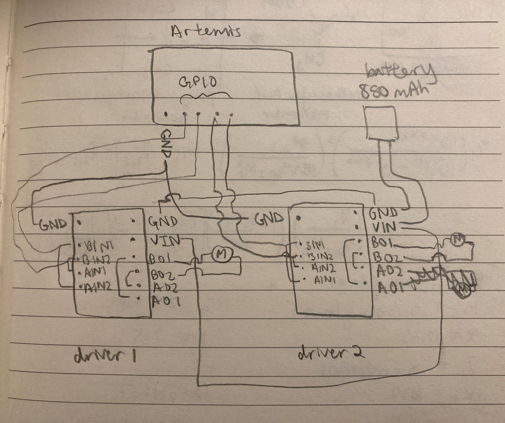
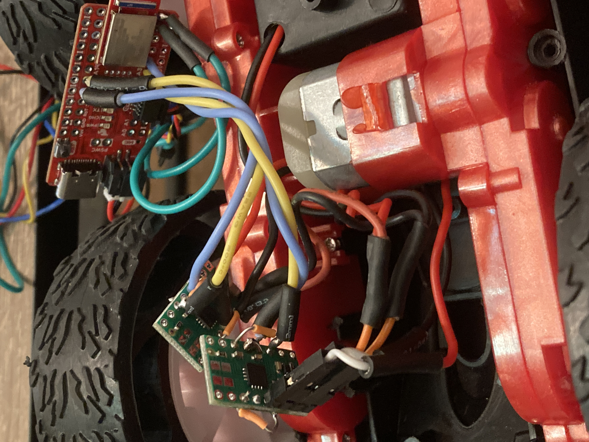
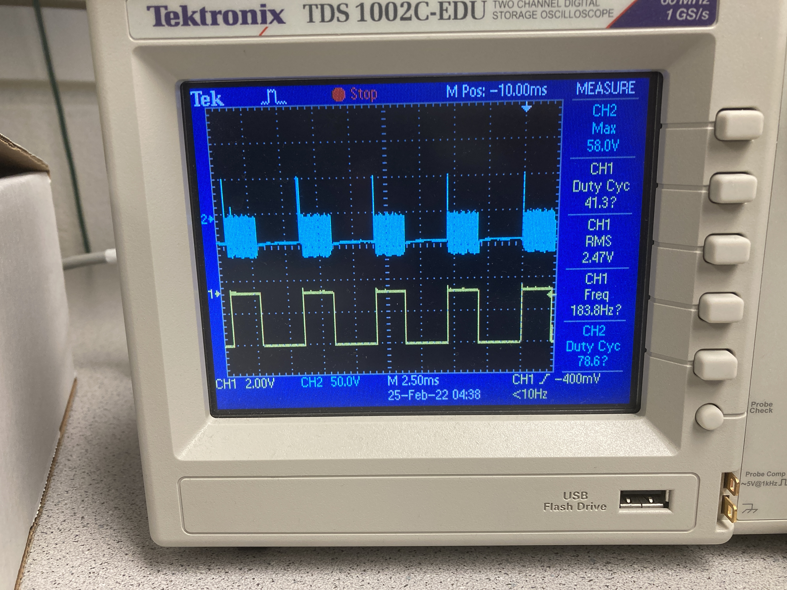

# Lab 5: Open Loop Control

## Objective
In this lab, the goal is to change from manual to open loop control of the car using the Artemis board and two dual motor drivers.

### Prelab
Before going to lab, I drew out a rudimentary sketch of how I wanted to hook up the motor drivers. 



While the sketch was a very rough idea of what I wanted to do, my circuit ended up pretty much the same by the end of lab. For each motor driver, the following input/output pins were shorted together: BIN1 and AIN1, BIN2 and AIN2, BOUT1 and AOUT1, BOUT2 and AOUT2. This setup allows us to use two channels to drive each motor, increasing the average current that can be delivered by two times. The 850 mAh battery is connected to both motor drivers using daisy chaining to provide power. The output pins on each board are connected to the motors, and the input pins are connected to GPIO pins on the Artemis board. The second motor driver in this chain is grounded to the Artemis board as well.

I decided to use pins A2 and A3 to control one motor and A15 and A16 to control the other, and I chose these because they are analog pins. (However, later on in the lab, I realized I accidentally soldered the first motor to A3 and 4 instead of A2 and A3. Pin 4 can still do PWM according to the Artemis pinout diagram, so the car still works as intended.) The Artemis is powered using a 650 mAh battery, while the motors are powered using an 850 mAh battery. The motors require more power than the Artemis, and using separate batteries for the Artemis and motor drivers/motors will allow us to supply plenty of power to the motors while not frying the board. 

Next, I considered the overall setup of the Artemis, batteries, sensors, wires, and motor drivers. I wanted the Artemis to go in the spot where the previous PCB board was located, and theoretically the motor drivers and 650 mAh battery could fit here too. The ToF sensors would be mounted to the front and side of the car, ideally in flat spots so that it would be easier to tape/adhere the sensors to the car. The IMU should go as far away from the motors as possible to reduce the effects of EMI, and the wires should also be twisted around each other. As for wires, I planned to use the standard red/black wires for power and ground (as well as the motors, which already have red/black wires connected to them), and for the input pins, I wanted to choose colors that have not been used already. I really like the soft stranded-core wires because they are flexible and easy for me to handle, and I wanted to use these as much as possible. 

### Lab Procedure
While I was in lab, I focused on the soldering component of this week's task, and I did the oscilloscope and power supply tests later on. First, I wanted to figure out where each part should go on the car chassis.

After taking out the control PCB that came with the car, there was much more space on that side of the car. I decided that this would be a good spot for the Artemis and motor drivers, while both of the batteries can fit nicely in the original battery compartment. One of the ToF sensors can be mounted to one side of the car in between the front and back wheels, and the other can be mounted to the side of the battery compartment so that it is perpendicular to the first. I chose these locations because they are relatively flat, making it easier to mount the ToF sensors. This setup also lets the car detect the distance in two directions (front and side). The IMU could also be mounted on the bottom of the battery compartment, and this should be as far from the motors as possible to reduce the effects of EMI. 

To test the motor drivers, I first hooked up and tested one motor driver. In Lab 3, I had issues with soldering strong connections between wires and the TOF/IMU sensors, so I tried using header pins on the first motor driver. I took a row of 4 male header pins and soldered this to the GND, VIN, B1OUT, and B2OUT pins on the first motor driver. I connected female header pins to all wires that needed to be connected to these pins. I used tiny jumper wires to connect BIN1/AIN1 and BOUT1/AOUT1, and I pooled a lot of solder around BIN2/AIN2 and BOUT2/AOUT2 to connect these. 

To test if the motor driver was properly hooked up with the motor, I ran the following code to see if the wheels would move:

```
#define motor1f A3
#define motor1b 4

void setup() {
  pinMode(motor1f, OUTPUT);
  pinMode(motor1b, OUTPUT);
}

void loop() {
  analogWrite(motor1f, 100);
  delay(1000);
  analogWrite(motor1f, 0);
  delay(5);
  analogWrite(motor1b, 100);
  delay(1000);
  analogWrite(motor1b, 0);
  delay(5);
}
```

With this code, I found that the motor worked as expected, and the wheels connected to the motor driver would spin in one direction for 1 second, then spin in the other direction for 1 second and keep looping forever. 

<iframe width="560" height="315" src="https://www.youtube.com/embed/Jj5P6zTzhWM" title="YouTube video player" frameborder="0" allow="accelerometer; autoplay; clipboard-write; encrypted-media; gyroscope; picture-in-picture" allowfullscreen></iframe>

In the video above, you can see that the motor can be run in both directions. While the connection is very strong using header pins, I found that this method takes up much more space. 

For the second motor driver, I got some soldering advice from my classmates and the TAs. Mainly, to make sure my wires don't bend and break, I inserted the wires into the board so that the wire coating was flush with the board. When adding the heat shrink, I also made sure that this was flush with the board to further secure the wire connection. I used the following code to check that both sets of wheels could spin in either direction:

```
#define motor1f A3
#define motor1b 4
#define motor2f A15
#define motor2b A16

void setup() {
  pinMode(motor1f, OUTPUT);
  pinMode(motor1b, OUTPUT);
  pinMode(motor2f, OUTPUT);
  pinMode(motor2b, OUTPUT);
}

void loop() {
  analogWrite(motor1f, 100);
  delay(1000);
  analogWrite(motor1f, 0);
  delay(5);
  analogWrite(motor1b, 100);
  delay(1000);
  analogWrite(motor1b, 0);
  delay(5);
  analogWrite(motor2f, 100);
  delay(1000);
  analogWrite(motor2f, 0);
  delay(5);
  analogWrite(motor2b, 100);
  delay(1000);
  analogWrite(motor2b, 0);
  delay(5);
}
```

<iframe width="560" height="315" src="https://www.youtube.com/embed/VGdzkjA9Cps" title="YouTube video player" frameborder="0" allow="accelerometer; autoplay; clipboard-write; encrypted-media; gyroscope; picture-in-picture" allowfullscreen></iframe>

As seen in the video above, both sets of wheels can move in either direction. The connections were just as strong as the other motor driver with header pins, and this method also saved a lot of space. The finished circuit with the motor drivers can be seen in the image below.



Then, I came in to the lab during office hours to do tests with an oscilloscope and power supply, and I worked on these parts with Syd Lawrence. We hooked up one motor driver to a power supply, then experimented with different voltage supplies. We found that around 0.2-0.25 V, the wheels were no longer getting enough power to move, and when the voltage is turned back up, the wheels can spin quite fast. This can be seen in the video below.

<iframe width="560" height="315" src="https://www.youtube.com/embed/XmgMZ5YOdYw" title="YouTube video player" frameborder="0" allow="accelerometer; autoplay; clipboard-write; encrypted-media; gyroscope; picture-in-picture" allowfullscreen></iframe>

We then hooked up a motor driver to an oscilloscope, and we uploaded a simple script to the Artemis. In the script, we used ```analogWrite``` and set the speed to a value of 150. As seen in the output on the oscilloscope display below, we can write an analog value to the board as a digital PWM signal, and we can control the duty cycle and thus the speed of the wheels.



Next, I arranged the components inside the car as described earlier. I attempted to organize wires by twisted them around each other and using twist ties, and the sensors and motor drivers are taped down to flat surfaces inside the car using double-sided tape. I made sure everything could fit inside the car when the blue cover was put back into place, and I determined that I needed to cut out a couple holes in the cover to allow access to the ToF sensors and Artemis board. I used the wire cutter to cut out holes, taped down loose wires using VWR tape, then screwed the cover back into place.


### Task 1: Lower limit for which each motor still turns while on the ground
For this task, I inputted different values to the car using ```analogWrite``` to see the lower limit for which the motors can still turn while on the ground. At this point, every component/sensor was completely packaged into the car, the Artemis board was powered by the 650 mAh battery, and the motors were powered by the 850 mAh battery. I ran tests for the following values: 80, 100, 120, 140, 160, 180, and 200. I found that the car could successfully start moving with a value of 180 (but with a lot of struggling), and setting the value to 200 allowed it to move at a reasonable speed. In the first video below, you can see the car struggling to move with a value of 160, and in the second video, it can spin in circles with a value of 200.

<iframe width="560" height="315" src="https://www.youtube.com/embed/tfGJhP1mSdU" title="YouTube video player" frameborder="0" allow="accelerometer; autoplay; clipboard-write; encrypted-media; gyroscope; picture-in-picture" allowfullscreen></iframe>

<iframe width="560" height="315" src="https://www.youtube.com/embed/ymmHUeO0Riw" title="YouTube video player" frameborder="0" allow="accelerometer; autoplay; clipboard-write; encrypted-media; gyroscope; picture-in-picture" allowfullscreen></iframe>

### Task 2: Calibration and driving in a straight line
When driving the car in a straight line, it tended to go to the left, so I needed to implement a calibration factor. To do this, I defined a value for motor speed and a calibration variable. In the code, I multiplied the motor speed for one of the wheels by the calibration variable, which I tweaked using trial and error in order to get the car to drive straight. 

```
int motor1_speed = 180;
float constant = 0.84;
int motor2_speed = int(motor1_speed*constant);
```

As seen below, the car can stay on a line while driving forward for 2m/6ft.

<iframe width="560" height="315" src="https://www.youtube.com/embed/Z8BWFwIS93A" title="YouTube video player" frameborder="0" allow="accelerometer; autoplay; clipboard-write; encrypted-media; gyroscope; picture-in-picture" allowfullscreen></iframe>

### Task 3: Open Loop Control
Next, to demonstrate open loop control, I had the robot drive in the following pattern: forward, turn left, forward, turn right, stop, backward, turn right, backward, turn left, stop. For each of the above movements, I wrote a simple function to carry out the task:

```
void forward(){
  analogWrite(motor1f, motor1_speed);
  analogWrite(motor2f, motor2_speed);
  delay(5);
}

void backward(){
  analogWrite(motor1b, motor1_speed);
  analogWrite(motor2b, motor2_speed);
  delay(5);
}

void left(){
  analogWrite(motor1f, 0);
  analogWrite(motor2f, motor2_speed);
  delay(5);
}

void right(){
  analogWrite(motor1f, motor1_speed);
  analogWrite(motor2f, 0);
  delay(5);
}

void stops(){
  analogWrite(motor1f, 0);
  analogWrite(motor2f, 0);
  delay(5);
}
```

The video below shows the car moving in the pattern described above:

<iframe width="560" height="315" src="https://www.youtube.com/embed/H6EJdq90kk0" title="YouTube video player" frameborder="0" allow="accelerometer; autoplay; clipboard-write; encrypted-media; gyroscope; picture-in-picture" allowfullscreen></iframe>

### Additional Task 1
Consider what frequency analogWrite generates. Is this adequately fast for these motors? Can you think of any benefits to manually configuring the timers to generate a faster PWM signal?

```analogWrite``` generates a PWM signal that has a frequency of 500 Hz by default. 

https://docs.particle.io/cards/firmware/input-output/analogwrite-pwm/#:~:text=Writes%20an%20analog%20value%20to,PWM%20signal%20is%20500%20Hz.

### Additional Task 2
Write a program that ramps up and down in speed slowly. Reporting the values to your computer using Bluetooth either during operation or when your ramp up/down procedure is over. Use this setup to document accurately what range of speeds you can achieve. (If your sensors are still attached, it may be easiest to use them to help you determine speed).


