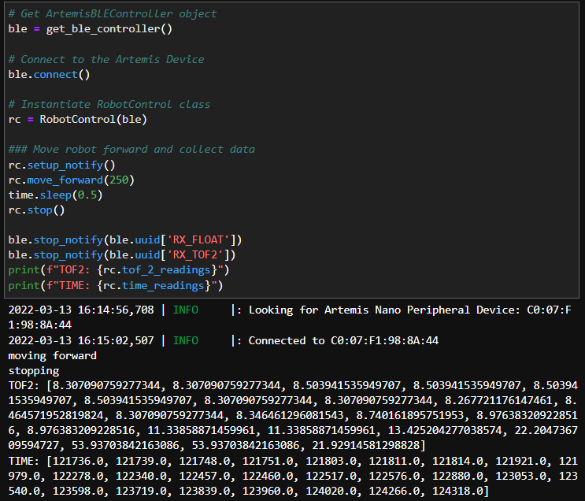

# Lab 6: Closed-loop Control (PID)

## Objective: Get experience with PID control.

## Prelab:
For this lab, I chose to do Task A (Don't Hit the Wall). Before starting to implement PID control, I set up a system for debugging. To do this, I wrote code that would integrate Bluetooth with code for the robot so that the on-board sensors could send readings back to my computer. The best way to do this is to have the robot start on an input from my computer sent over Bluetooth, store data and time stamps for the front TOF sensor in arrays, then send the data back to the computer over Bluetooth. 

First, I combined Arduino code for Bluetooth, the TOF sensors, and motor drivers into one script. I added two commands (which the robot can recognize using the read_data() function in the Arduino code) so that I could tell the car to start and stop through Bluetooth.

```
case MOVE_FORWARD:
    Serial.println("move forward");
    int motorspeed;
    success = robot_cmd.get_next_value(motorspeed);
    if (!success)
      return;
    analogWrite(motor1f, motorspeed);
    analogWrite(motor2f, int(motorspeed*constant));
    break;

case STOP:
    Serial.println("case 2");
    analogWrite(motor1f, 0);
    analogWrite(motor2f, 0);
    analogWrite(motor1b, 0);
    analogWrite(motor2b, 0);
    break;
```

Next, I wrote a function that would allow the robot to get TOF distance readings.

```
float get_tof_2(){
  distanceSensor2.startRanging();
  distance2 = distanceSensor2.getDistance();
  distanceSensor2.clearInterrupt();
  distanceSensor2.stopRanging();

  return distance2;
}
```

The following code can be used to store the readings into arrays.

```
get_current_time = millis();
time_array[counter] = get_current_time;
tof_distance = get_tof_2();
tof_array[counter] = tof_distance;

counter++;
```

To send the arrays to my computer over Bluetooth, I wrote each value in the array to float characteristics, and they are stored in a growing array in the Python code.

```
for (int i=0; i<sizeof(tof_array); i++){
  tof_2_float.writeValue(tof_array[i]);
  tx_characteristic_float.writeValue(time_array[i]);
}
```

In the Jupyter notebook, I created a robot control class, and it also has functions for notification handlers and can send start/stop commands to the robot. However, the code is unable to upload to the Artemis board, and a blue light on the board flashes when I try. I was unable to figure out how to fix this issue, so I ended up using a method in which the board continuously sends data over Bluetooth. This method really slows down the sampling rate because sending data over Bluetooth takes up extra time, but this method is still sufficient when running the robot at a slower speed.

```
get_current_time = millis();
tx_characteristic_float.writeValue(get_current_time);
tof_distance = get_tof_2();
tof_2_float.writeValue(tof_distance);
```



After a couple trials, I found that the sensor could record and send the distance readings every 5 milliseconds on average. When I was debugging the debugging code, I had a couple of ```delay``` and ```Serial.println``` functions, and since these slow down the control loop, I commented these out after I confirmed that the code could function. I ended up keeping the "while(central.connected())" line in the main loop, since this could allow me to control the robot better -- as soon as the robot is connected to Bluetooth, I can tell it to start and stop from my code in the Jupyter notebook, and I eliminated the risk of having to chase down the robot when it goes rogue and runs away.

## Lab Procedure:
I first tried to use the PID library in Arduino, and I used the following code.

```
tof_distance = get_tof_2();
  Input = tof_distance;
  Setpoint = 300;
  myPID.Compute();

  motorspeed = map(Output, 0, 255, 100, 160);
  Serial.println(Output);
  analogWrite(motor1f, motorspeed);
  analogWrite(motor2f, int(motorspeed*constant));
```

In lab 5, I found the deadband of the motor to be around an analogWrite value of 200, however, this value fluctuates based on how much charge the battery has. (I may have done deadband experiment while the battery was low, and when using a fresh battery in lab 6, I found that the robot could actually drive when I input much lower values.) To scale the output from the PID compute function, I used the built-in map function, which let me rescale the output (which is on a scale of 0 to 255) to a range of 100 to 160. Unfortunately, after a lot of tweaking, the only thing that the PID function could output was 0.0, and it was unsuccessful. I ended up implementing simple code for P control, and I set the proportional gain to 0.9. To try to prevent overshooting, the robot would slow down as it got closer to the setpoint.

```


```
<iframe width="560" height="315" src="https://www.youtube.com/embed/VbYXMs84bSU" title="YouTube video player" frameborder="0" allow="accelerometer; autoplay; clipboard-write; encrypted-media; gyroscope; picture-in-picture" allowfullscreen></iframe>

<iframe width="560" height="315" src="https://www.youtube.com/embed/-yr9hlKL1xk" title="YouTube video player" frameborder="0" allow="accelerometer; autoplay; clipboard-write; encrypted-media; gyroscope; picture-in-picture" allowfullscreen></iframe>

<iframe width="560" height="315" src="https://www.youtube.com/embed/0kauGsqwnus" title="YouTube video player" frameborder="0" allow="accelerometer; autoplay; clipboard-write; encrypted-media; gyroscope; picture-in-picture" allowfullscreen></iframe>

From the videos above, the robot worked the most reliably in lab, and it consistently stopped about 300 mm in front of the board. However, when I brought the car home, it started having issues with Bluetooth connection, and sometimes the motors would not work. In the end, I was able to make it stop in front of the wall, but the distance that it stopped at was more variable.

Overall, this method slowed down the robot considerably, and Jade suggested that I try adding oscillations so that the robot could go faster, and when it inevitably overshoots, it would be able to find the correct setpoint by going backwards. 

```
tof_distance = get_tof_2();
float error = tof_distance - setpoint;
float proportional_term = error*kp;

if(proportional_term > 5){
    motorspeed = map(proportional_term, 0, 2000, 80, 255);
    // set forward motor speed
}
else if(proportional_term < -5){
    motorspeed = map(proportional_term, 0, -300, 80, 255);
    // set backward motor speed
}
else{
    // active braking
}
```

With a setpoint at 300 mm, the robot overshot the setpoint by a lot and ended up crashing, but it was able to quickly back up and find the correct location again.

<iframe width="560" height="315" src="https://www.youtube.com/embed/rdnoQeJK3Ug" title="YouTube video player" frameborder="0" allow="accelerometer; autoplay; clipboard-write; encrypted-media; gyroscope; picture-in-picture" allowfullscreen></iframe>

I found this lab to be especially difficult since I don't have much coding experience outside of basic robotics and bioinformatics, so I wasn't able to work on including an integrator or derivative. However, adding the integrator term should be quite easy, and it would help address offsets due to past errors. To implement this, you can multiply the error at a time step by the length of the time step, then add this to the integrator term. This term is then multiplied by the integral gain and added to the proportional term to get the overall controller output. 

### [Click here to return to homepage](https://lyl24.github.io/lyl24-ece4960)
