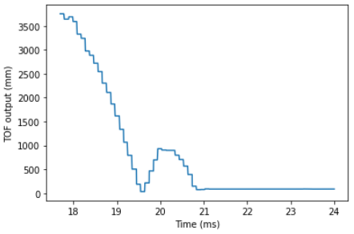
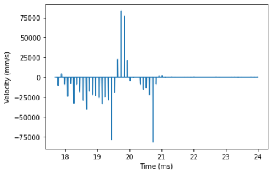
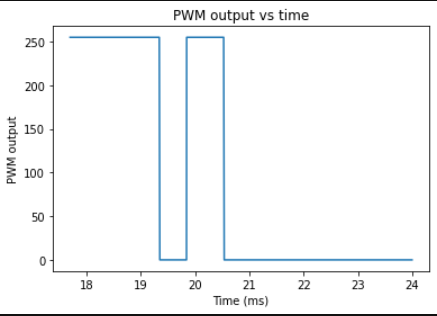
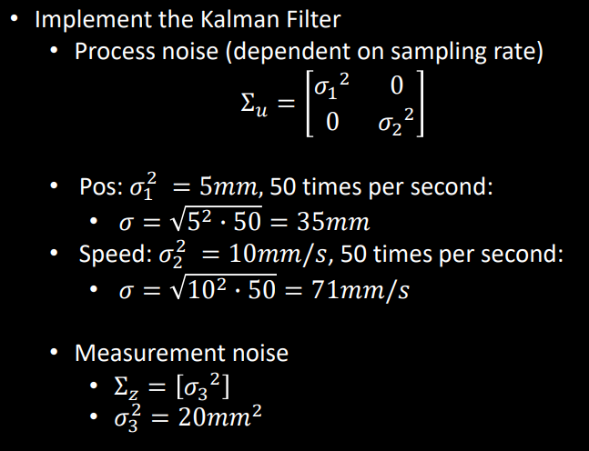
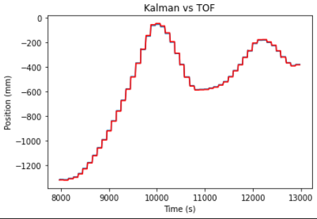

# Lab 7: Kalman Filter

## Objective: Implement a Kalman Filter to help speed up the TOF sensor for Lab 8 (Stunts)

## Lab Procedure:

## Part 1: Step Response
The first step is to execute a step response by driving the car towards a wall as fast as possible while logging motor input values and the TOF sensor output. To do this, I added the code below to the Artemis board, which allows the robot to drive towards the wall at top speed (PWM input = 255). With this code, I was able to store motor input values, TOF sensor output, and time into arrays, which were then sent over to my computer using bluetooth after the robot finished running.

```
read_data();
  tof_distance = get_tof_2();

  get_current_time = millis();
  time_array[counter] = float(get_current_time);
  tof_array[counter] = float(tof_distance);

  float error = tof_distance - setpoint;
  if(error >= 300){
    motorspeed = 255;
    analogWrite(motor1b, 0);
    analogWrite(motor2b, 0);
    analogWrite(motor1f, motorspeed);
    analogWrite(motor2f, int(constant*motorspeed));
    motor_array[counter] = float(motorspeed);
    Serial.println(motorspeed);
  }
  else{
    analogWrite(motor1f, 255);
    analogWrite(motor1b, 255);
    analogWrite(motor2f, 255);
    analogWrite(motor2b, 255);
    motor_array[counter] = float(0.0);
    Serial.println("stop");
  }
  counter++;
```

From the data I collected, I was able to make graphs for the TOF sensor output (distance vs time), the computed speed (velocity vs time), and the motor input. *NOTE: For all the graphs below, the times are all in seconds and not milliseconds. I just forgot to change the axis labels.

TOF sensor output (distance vs time):


Computed speed (velocity vs time):


Motor input values:


I measured the steady state speed to be around 2250 mm/s using the slope of the TOF sensor output between 18-19 seconds where it is relatively linear. I estimated the rise time to be about 1.5 seconds using the velocity graph. Using these two values, I was able to find the values for d and m, which I then plugged into Python code to compute the A and B matrices (see below).

## Part 2: Kalman Filter Setup
To setup the Kalman filter, I first needed to make the covariance matrices for process noise and sensor noise. I used the following equations from lecture to do this:



Next, I used the code below to insert these values into matrix format. I also initialized the A, B, and C matrices, as well as the discretized matrices for A and B and the state vector.

```
sigma_1 = 35
sigma_2 = 71
sigma_3 = 5 
sigma_4 = 4.5
d = 0.000444
m = 0.00029
Delta_T = 8

#initialize uncertainty matrices
sig_u=np.array([[sigma_1**2,0],[0,sigma_2**2]]) #We assume uncorrelated noise, therefore a diagonal matrix works.
sig_z=np.array([[sigma_4**2]])
sigma = np.array([[sigma_3**2,0],[0,sigma_3**2]])

mu = np.array([[-TOF[0]],[0]])

A=np.array([[0,1],[0,-d/m]])
B=np.array([[0],[1/m]])
C=np.array([[-1,0]])

Ad = np.eye(2) + Delta_T * A  #n is the dimension of your state space 
Bd = Delta_T * B
```

## Part 3: Sanity Check Your Kalman Filter
Next, I ran the Kalman function code provided in the lab description, and I had to make a couple tweaks in the naming scheme to make the code consistent.

```
def kf(mu,sigma,u,y):   
  mu_p = Ad.dot(mu) + Bd.dot(u) 
  sigma_p = Ad.dot(sigma.dot(Ad.transpose())) + sig_u

  y_m = y-C.dot(mu_p)
  sigma_m = C.dot(sigma_p.dot(C.transpose())) + sig_z
  kkf_gain = sigma_p.dot(C.transpose().dot(np.linalg.inv(sigma_m)))

  mu = mu_p + kkf_gain.dot(y_m)    
  sigma=(np.eye(2)-kkf_gain.dot(C)).dot(sigma_p)

  return mu,sigma
```

I then looped through my data from Lab 6 using the following code. I divided u by 255 to rescale the results to the step size I used.

```
kf_state = []

for u, y in zip(MOTORS, TOF):
  mu, sigma = kf(mu, sigma, [[u/255]],[[y]])
  kf_state.append(mu[:,0])
```

I plotted the resulting graph on top of the original sensor readings graph.



As seen in the graph, the original readings (red) and the outputs from the Kalman filter (blue) are quite close and difficult to distinguish. When I adjusted the sigma values to be significantly lower, the blue line deviated from the red line, so I determined that the sigma values that I initially chose were sufficient.

## Part 4: Implement the Kalman Filter on the Robot

### [Click here to return to homepage](https://lyl24.github.io/lyl24-ece4960)
