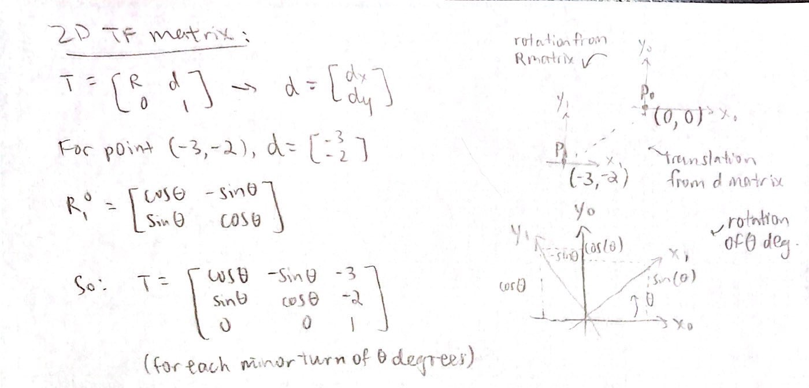
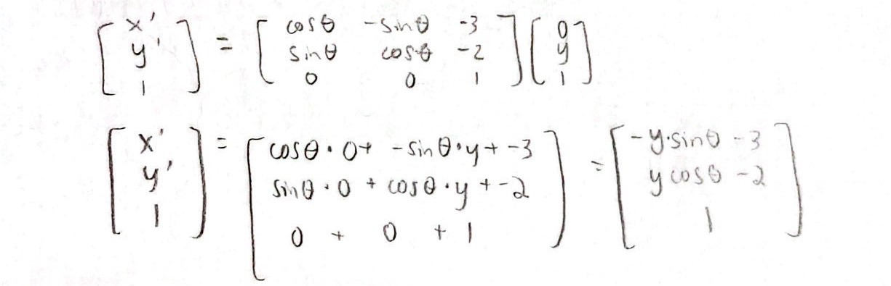
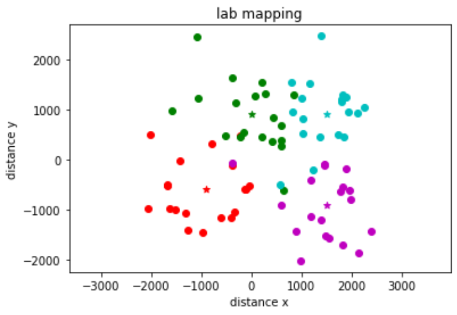
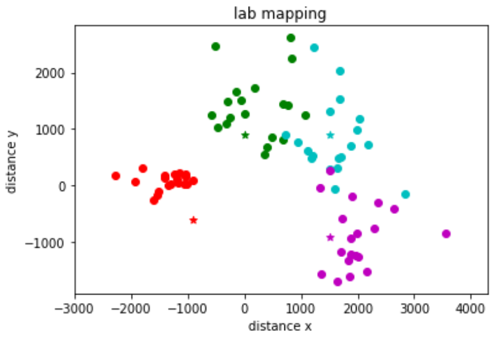
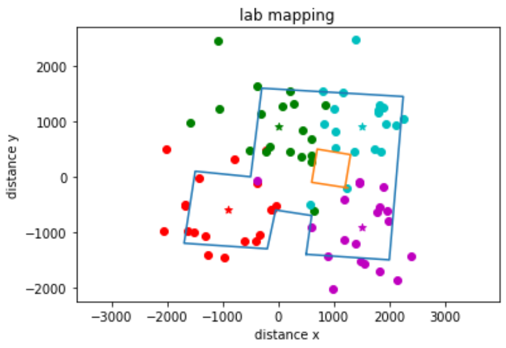
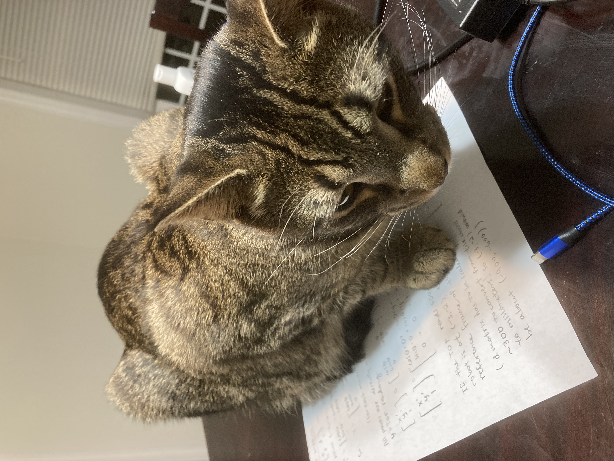

# Lab 9: Mapping

## Objective:
For this lab, the goal is to build a map of a static room (the front room of the lab). To do this, the first step is to code the robot to turn around in a circle slowly while gathering data from the IMU and TOF sensors, then use transformation matrices to plot the data into a map of the room. This map will be used in future labs on localization and navigation.

## Programming the robot to simultaneously spin and collect data:

### Attempt #1: Stop and Go
In my first attempt, I tried to get the robot to rotate about 20 degrees per turn. In the setup loop, I first obtained the initial angle and TOF sensor reading, and I also set up a setpoint. After obtaining the initial angle, the setpoint would then be set to the value of the initial angle + 20 degrees. In the main loop, the robot continuously gathers IMU data, and if the the robot's heading is not yet at the setpoint, it will spin to the left. As soon as it reaches the setpoint, it will do a hard brake, delay for a bit, then gather the TOF reading. Once complete, the setpoint is incremented by 20 degrees again, and this process is repeated until the robot reaches a full 360 degree turn. The main loop code is as follows:

```ccp
while(central.connected()){
      read_data();
      
      previous_time = current_time;
      myICM.getAGMT();
      current_time = millis();
      previous_gyrX = current_gyrX;
      current_gyrX = get_gyroscope(&myICM);

      error_value = setpoint - current_gyrX;
      
      if(error_value > 1.0 && setpoint < 350.0){
        motorspeed = 120;
        turn_left();     
      }
      else if(error_value <= 1.0 && setpoint < 350.0){
        brake();
        delay(300);
        tof_distance = get_tof_2();
        gyr_array[counter] = current_gyrX;
        tof_array[counter] = tof_distance;
        counter++;
        setpoint = setpoint + 20;
        current_time = millis();
      }
      else{
        brake();
      }
```

To collect angle readings, I created a separate function to convert angular speed readings to angle. To find the current angle, I also had to add in a slight calibration factor of 0.005 to account for drift.

```ccp
float get_gyroscope(ICM_20948_I2C *sensor) {
  dt = (current_time - previous_time)*0.001;
  current_gyrX = previous_gyrX - (sensor->gyrX())*dt + 0.005;
  previous_gyrX = current_gyrX;
  return current_gyrX;
}
```

There was a recurring erorr where the gyroscope would not start at 0 degrees, and it typically would have a number around -10 degrees as the initial angle. I attempted to fix this issue by calibrating for the error: ```output_gyr = current_gyrX - offset_gyr```, where the ```offset_gyr``` variable calibrates all values so that the starting angle is equal to 0. This method did not make the results significantly better, so I eventually got rid of this line.

<iframe width="560" height="315" src="https://www.youtube.com/embed/5Am0pRBLigA" title="YouTube video player" frameborder="0" allow="accelerometer; autoplay; clipboard-write; encrypted-media; gyroscope; picture-in-picture" allowfullscreen></iframe>

As seen in the video above, the robot tends to overshoot each turn by about 5 degrees (leading to a total overshoot of 80 degrees and a total rotation of 440 degrees). While working in the lab, I attempted to add on some "hacks" to minimize the overshoot, and I was only able to reduce the overshoot by a tiny bit. Vivek suggested that I add a PID controller to make the turns more accurate, which leads us to Attempt #2.

### Attempt #2: Stop and GO with PID controller
In my second attempt to get the stop and go code to work better, I implemented basic P control on the angle. Similar to the first attempt, I created setpoints that the robot would aim to stop at. In addition, I added a proportional term, scaled by the constant kp. The value of the proportional term is then scaled to a PWM range for the motors. When the error is small and the proportional term is low, the robot is close to the setpoint and slows down the turn to help prevent overshooting.

```ccp
while(central.connected()){
      read_data();
      
      previous_time = current_time;
      myICM.getAGMT();
      current_time = millis();
      previous_gyrX = current_gyrX;
      current_gyrX = get_gyroscope(&myICM);

      error_value = setpoint - current_gyrX;
      float proportional_term = error_value*kp;
      
      if(error_value > 2.0 && setpoint < 350.0){
        motorspeed = map(proportional_term, 0, 30, 90, 115);
        turn_left(); 
      }
      else if(error_value <= 2.0 && setpoint < 350.0){
        brake();
        delay(300);
        tof_distance = get_tof_2();
        gyr_array[counter] = current_gyrX;
        tof_array[counter] = tof_distance;
        counter++;
        setpoint = setpoint + 20;
        current_time = millis();
      }
      else{
        brake();
      }
```

After implementing the code on the robot, the total overshoot did not decrease significantly. The robot kept overshooting by about 80 degrees, and it spun in a circle similar to the video above. I noticed that in both of these attempts, the wheels would not turn steadily at all for lower PWMs, even when I added tape to the wheels to decrease static friction. For example, during each run, one wheel would suddenly be drastically slower or faster than the other, and my attempts to introduce a scaling factor to equalize the wheel speed did not help much. In addition, for each individual run, there would be some turns where neither wheel could turn at all, as well as other turns where it would suddenly find the energy to rotate very quickly and overshoot the turn. 

I implemented Attempts #1 and #2 while in lab before Spring Break, and I ended up collecting data using Attempt #1 just to see if the results would still be okay. The robot kept overshooting to about 440 degrees physically but thinking it rotated 360 degrees, so each of the resulting data points progressively got more and more incorrect. I was worried that the map using this bad data would completely be a hairball, however it looked somewhat reasonable when plotted out (see below).

### Attempt #3: A new approach to Stop and Go
After plotting the data from Attempt #1, I was unhappy with the results, so I wanted to see if I could code up a better stop and go program over Spring Break.

## Read out distances
For this part, I set up the robot on all points in the front room of the lab (excluding the origin) and allowed it to run through the code many times. The area that I want the robot to map out is shown below.


To get the robot to start data collection, I ran some commands through Python and had the robot send data to my computer using Bluetooth:

```python
ble = get_ble_controller()
ble.connect()
rc = RobotControl(ble)
rc.setup_notify()
rc.ble.send_command(CMD.SEND_DATA, None)
time.sleep(5)
ble.disconnect()
print(f"IMU: {rc.imu_readings}")
print(f"TOF2: {rc.tof_2_readings}")
```

While the robot was very inaccurate with rotating 360 degrees, I ran the code many times and found that it was at least consistent in its errors. When looking at the TOF sensor data, I found that each of the distances that were read were within a reasonable range of what I would expect for each particular spot. I plotted the data using a polar coordinate plotter, however I couldn't make sense of the data and Vivek suggested that a scatter plot would be much more helpful.


## Merge and Plot the Readings
The next step is to compute the transformation matrices and convert the measurements from the TOF sensor to the inertial reference frame of the room. To start, wrote out the 2D transformation matrix that handles both translation and rotation about the origin.



In my calculation, I used the point (-3,-2) as an example. For all readings at this spot, I wanted to incorporate translation from (0,0) to (-3,-2), as well as rotation about theta (which comes from the robot spinning in a circle). To get the points in the inertial reference frame of the room, the distance readings from the robot must be multiplied by the 2D transformation matrix. 



All points are directly ahead of the robot since my TOF sensor is mounted on the front, so from the robot's point of view, points in front are at x = 0 and y = TOF reading. If the robot is at (-3,-2), the TOF reads 500 mm, and the IMU reads 20 degrees, then the point from the inertial reference frame of the room is (-1356.4726, -395.95897) in millimeters. (The coordinates given in the classroom are in units of number of tiles, and each tile is approximately 300 mm. Therefore, (-3,-2) would be about (-900,-600) in millimeters.) I translated the work I did on paper to Python code, and the transformation function is as follows:

```python
def transformation(angle, distance, x_0, y_0):
    measured_distance = np.array([[0],[distance],[1]])
    tf_matrix = np.array([[np.cos(angle), -np.sin(angle), x_0], [np.sin(angle), np.cos(angle), y_0], [0, 0, 1]])
    output_matrix = np.matmul(tf_matrix, measured_distance)
    
    x_1 = output_matrix[0][0]
    x_2 = output_matrix[1][0]
    return x_1, x_2
```

I used for loops to run all of my data through the transformation function, which takes the following inputs: angle, corresponding TOF distance reading, x-coordinate of the robot from the inertial reference frame, and y-coordinate of the robot from the inertial reference frame. Once all of my data was processed, I plotted it on a scatter plot. I assigned different colors to data sets acquired from each turn, and I plotted stars in the locations where the data were collected.



The points on the plot are all around where I expected them to be, however there is not a super clear outline of the room. I tried to rescale my data to see if it would help - the robot kept physically turning from 0 to 440 degrees, however it would mark down the angles in a range of -10 to 350 instead. I used the following function in Python to rescale the angle values:

```python
def rescaler(x, x_min, x_max):
    x_norm = (x-x_min)/(x_max-x_min)
    x_norm = x_norm*440
    return x_norm
```

The resulting data was actually quite bad compared to the first plot, though I'm not sure if it's because I made an error somewhere in the code or if rescaling truly was a terrible idea. Either way, I determined that the best thing to do is to try to improve my stop and go code, and I embarked on Attempt #3 (see above).



## Convert to Line-Based Map
Next, I estimated where the actual walls and obstacles were based on the scatter plot, and I drew lines on top of these.



While the data from Attempt #1 was pretty bad, some of the major features of the room are still recognizable such as the overall shape and also the presence of some obstacles in the middle. I saved lists containing the end points of these lines, which can be used in the simulator for the next lab. (*Note: The code below shows two lists each for the x and y values, and this was so that I could show the cardboard box in the middle of the room as a separate set of lines.)

```python
x_values = [500, 600, -50, -200, -1700, -1500, -500, -300, 2250, 2000, 500]
y_values = [-1400, -700, -600, -1300, -1200, 100, 0, 1600, 1450, -1500, -1400]
plt.plot(x_values, y_values)
x_values2 = [1250, 600, 700, 1300, 1200]
y_values2 = [-200, -100, 500, 400, -200]
plt.plot(x_values2, y_values2)
plt.show()
```

## Bonus Content
To help figure out the math for the transformation matrices, my roommate's cat (Tostito "Toast" Sriram) sat on my paper.



### [Click here to return to homepage](https://lyl24.github.io/lyl24-ece4960)
